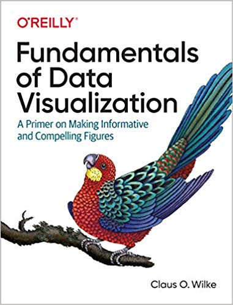

Resources
================

# Books

## Data visualization using R (optional)

Clicking on the covers will send you to the free online versions of each
book

## R fundamentals (optional)

## R Markdown (optional)

Of partcular interest to us will be chapters on
<a href="https://bookdown.org/yihui/rmarkdown/html-document.html" target="_blank">HTML documents</a>
and
<a href="https://bookdown.org/yihui/rmarkdown/ioslides-presentation.html" target="_blank">HTML Presentations</a>

### Other books

-   <a href="http://www.thefunctionalart.com/p/the-truthful-art-book.html" target="_blank">The Truthful Art: Data, Charts, and Maps for Communication</a>
    by Albert Cairo
-   <a href="https://www.amazon.com/gp/product/0470944889/" target="_blank">FLowing Data</a>
    by Nathan Yau
-   <a href="http://www.cookbook-r.com/Graphs/" target="_blank">R Graphics Cookbook</a>
    by Winston Chang
-   <a href="http://web.stanford.edu/class/bios221/book/index.html" target="_blank">Modern Statistics for Modern Biology</a>
    by Susan Holmes and Wolfgang Huber

------------------------------------------------------------------------

# Web references

## Data viz

-   <a href="https://ggplot2.tidyverse.org/" target="_blank">ggplot2 reference</a>:
    The definitive guide to ggplot2. Check out the pages for the
    different functions for great examples
-   [R graph gallery](https://www.r-graph-gallery.com/): Example-filled
    site for different R-based graphs, specially in ggplot. The ads can
    be a bit irritating, but the content is great.
-   [htmlwidgets for R](https://www.htmlwidgets.org/): Reference and
    gallery for different Javascript interactive graphics libraries that
    have been ported to R
-   Bioinformatics-related
    -   <a href="http://www.bioconductor.org/packages/release/BiocViews.html#___Visualization" target="_blank">Bioconductor packages</a>
        for visualization
        -[heatmaply](https://cran.r-project.org/web/packages/heatmaply/vignettes/heatmaply.html):
        R package for interactive heatmaps
    -   [manhattanly](https://cran.r-project.org/web/packages/manhattanly/):
        R package for interactive Manhattan plots
    -   [Graphics
        chapter](http://web.stanford.edu/class/bios221/book/Chap-Graphics.html)
        from *Modern Statistics for Modern Biology* by Holmes and Huber

## R programming

-   
-   Bioinformatics-related
    -   [RNAseq analysis in
        R](http://combine-australia.github.io/RNAseq-R/)
    -   [GEN 242](http://girke.bioinformatics.ucr.edu/GEN242/index.html)
        course website from University of California Riverside
    -   [RNA-seq analysis is easy as 1-2-3 with limma, Glimma and
        edgeR](https://f1000research.com/articles/5-1408/v3): Open
        review paper on using R for RNA-seq analysis
    -   [Analysis of single cell RNA-seq
        data](https://hemberg-lab.github.io/scRNA.seq.course/index.html)
        from Hember lab

------------------------------------------------------------------------

# Web resources

-   [Flowing Data](https://www.flowingdata.com): This is one of my
    favorite sites for learning data viz. There are several
    [tutorials](https://flowingdata.com/category/tutorials/) in R for
    different graphics, as well as other languages. Nathan Yau, who runs
    the website, also has 2 excellent
    [books](https://flowingdata.com/books/) on data viz, as well as a
    few self-guided [courses](https://flowingdata.com/courses/) for data
    viz in R.
-   [JunkCharts](https://junkcharts.typepad.com): Critiques of
    chartjunk + junk art
-   [I want hue](https://medialab.github.io/iwanthue/): Colors for data
    scientists

## Infographics

-   [BusinessPundit’s Guide to
    Infographics](https://www.businesspundit.com/guide-to-infographics/)

-   [A complete exploratory data analysis and visualization for text
    data](https://towardsdatascience.com/a-complete-exploratory-data-analysis-and-visualization-for-text-data-29fb1b96fb6a)

-   

    ------------------------------------------------------------------------

# ggplot2-related resources

-   <a href="https://ggplot2.tidyverse.org/" target="_blank">ggplot2 reference</a>:
    The definitive guide to ggplot2. Check out the pages for the
    different functions for great examples
-   <a href="https://github.com/rstudio/cheatsheets/raw/master/data-visualization-2.1.pdf" target="_blank">ggplot2 cheatsheet</a>
-   <a href="https://www.r-graph-gallery.com/cheatsheet/" target="_blank">Cheatsheets</a>
    from the
    <a href="https://www.r-graph-gallery.com/" target="_blank">R-Graph Gallery</a>
-   [Themes to improve your ggplot
    figures](https://rfortherestofus.com/2019/08/themes-to-improve-your-ggplot-figures/)
