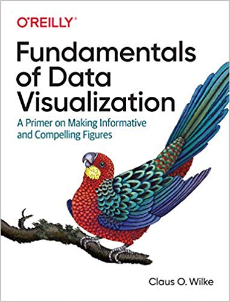

# Books

## General Python resources

## Data visualization

{target=_blank}

Clicking on the covers will send you to the free online versions of each book

### Other books

- [The Truthful Art: Data, Charts, and Maps for Communication](http://www.thefunctionalart.com/p/the-truthful-art-book.html){target=_blank} by Albert Cairo
- [Visualize This](https://www.amazon.com/gp/product/0470944889/){target=_blank} by Nathan Yau

-----

# Web references

## Data viz
- [ggplot2 reference](https://ggplot2.tidyverse.org/){target=_blank}: The definitive guide to ggplot2. Check out the pages for the different functions for great examples
- [Python graph gallery](https://www.python-graph-gallery.com/): Example-filled site for different python-based graphics. The ads can be a bit irritating, but the content is great.

-----

# Web resources

- [Flowing Data](https://www.flowingdata.com): This is one of my favorite sites for learning data viz. There are several [tutorials](https://flowingdata.com/category/tutorials/) in R for different graphics, as well as other languages. Nathan Yau, who runs the website, also has 2 excellent [books](https://flowingdata.com/books/) on data viz, as well as a few self-guided [courses](https://flowingdata.com/courses/) for data viz in R.
- [PolicyViz](https://policyviz.com/): This website by the excellent Jonathan Schwabish has a host of information about data visualization, often colored by his experiences in policy development for think tanks and the government. 
- [JunkCharts](https://junkcharts.typepad.com): Critiques of chartjunk + junk art
- [I want hue](https://medialab.github.io/iwanthue/): Colors for data scientists

## Infographics

- [BusinessPundit’s Guide to Infographics](https://www.businesspundit.com/guide-to-infographics/)
- [A complete exploratory data analysis and visualization for text data](https://towardsdatascience.com/a-complete-exploratory-data-analysis-and-visualization-for-text-data-29fb1b96fb6a)

## Issue-based resources

- [Plotting pitfalls](https://anaconda.org/jbednar/plotting_pitfalls/notebook), Anaconda

