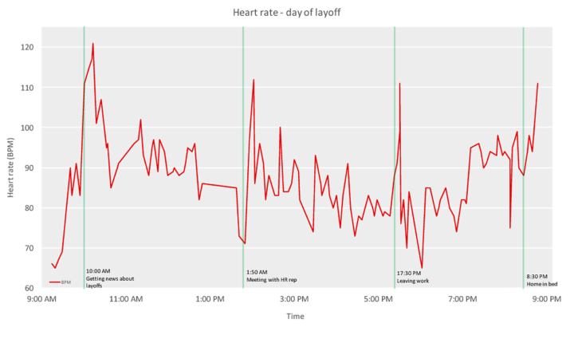
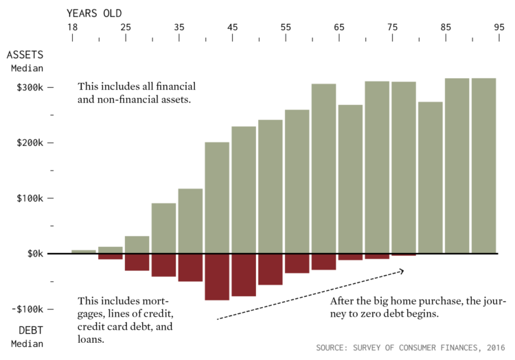
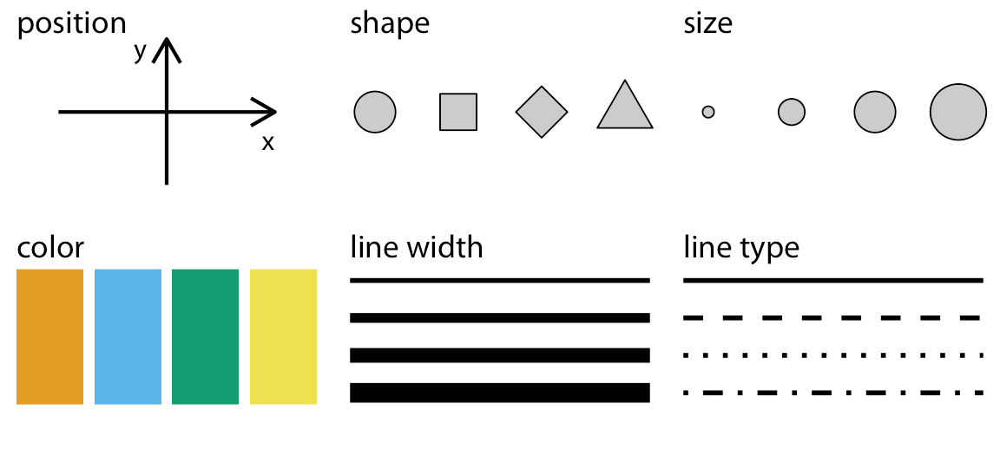

---
jupyter:
  jupytext:
    formats: ipynb,Rmd,py:percent
    text_representation:
      extension: .Rmd
      format_name: rmarkdown
      format_version: '1.2'
      jupytext_version: 1.10.3
  kernelspec:
    display_name: Python 3
    language: python
    name: python3
---

<!-- #region slideshow={"slide_type": "slide"} -->
<h1 class='center'> Statistical data visualizations (static)</h1>
<h2 class='center'>BIOF 440</h2>

<h2 class='center'>Abhijit Dasgupta</h2>

<!-- #endregion -->

<!-- #region nteract={"transient": {"deleting": false}} -->
> The presentation was done using a Jupyter add-in called RISE. It doesn't print or save well. This is the Jupyter notebook that is used directly for the slides this week.
<!-- #endregion -->

<!-- #region slideshow={"slide_type": "slide"} -->
# Data visualization
<!-- #endregion -->

<!-- #region slideshow={"slide_type": "slide"} -->
## Visualization for analysis

- Tool for understanding datasets
- You ask questions and quickly answer them
- Iterate to develop insights.
<!-- #endregion -->

<!-- #region slideshow={"slide_type": "slide"} -->
## Context is important

A data visualization should be self-contained and be able to express the **context** of the data. 

This makes the visualization **informative**.



This chart is not novel or fancy, but the annotations make it relevant and contextual
<!-- #endregion -->

<!-- #region slideshow={"slide_type": "subslide"} -->
## Improve readability

Data visualizations should be readable. It should be obvious what the chart is about and how to interpret it.
<!-- #endregion -->

<!-- #region cell_style="split" slideshow={"slide_type": "fragment"} -->

<!-- #endregion -->

<!-- #region cell_style="split" slideshow={"slide_type": "fragment"} -->


<!-- #endregion -->

<!-- #region hide_input=false slideshow={"slide_type": "subslide"} -->
## Some ideas

- Your visualization depends on your audience
    + If the audience is your lab group (has a similar contextual background), then you may not have to provide as much context in your visualization
    + If you audience is a conference or a journal reader, you probably need to have more detail and context within the visualization
<!-- #endregion -->

<!-- #region slideshow={"slide_type": "subslide"} -->
- Your visualization needs to reflect the character of the data
    + Continuous <--> categorical <--> binary
    + Dates and times
    + Spatial data (may be related to objects other than maps, like cell structure or organisms)
    + Networked or co-related data
<!-- #endregion -->

<!-- #region slideshow={"slide_type": "slide"} -->
> Design is choice. The theory of the visual display of quantitative information consists of principles that generate design options and that guide choices among options. The principles should not be applied rigidly or in a peevish spirit; they are not logically or mathematically certain; and it is better to violate any principle than to place graceless or inelegant marks on paper. Most principles of design should be greeted with some skepticism, for word authority can dominate our vision, and we may come to see only through the lenses of word authority rather than with our own eyes.
>
> -- <cite>Edward Tufte, The Visual Display of Quantitative Data
<!-- #endregion -->

<!-- #region slideshow={"slide_type": "subslide"} -->
## Tufte's Principles of Graphical Integrity

1. Show data variation, not design variation
1. Do not use graphics to quote data out of context
1. Use clear, detailed, thorough labelling.
1. Representation of numbers should be directly proportional to numerical quantities
1. Don't use more dimensions than the data require
<!-- #endregion -->

<!-- #region slideshow={"slide_type": "subslide"} -->
## Tufte's Principles of Graphical Integrity

1. Show data variation, not design variation
   - Don't get fancy, let the data speak
1. Do not use graphics to quote data out of context
   - Maintain accuracy
1. Use clear, detailed, thorough labelling.
   - Use annotations to make your point
1. Representation of numbers should be directly proportional to numerical quantities
   - This is essential for fair representation
1. Don't use more dimensions than the data require
   - Be appropriate in use of 3D graphics, for example
<!-- #endregion -->

<!-- #region slideshow={"slide_type": "subslide"} -->
## Tufte's Fundamental Principles of Design

   1. Show comparisons
   1. Show causality
   1. Use multivariate data
   1. Completely integrate modes (like text, images, numbers)
   1. Establish credibility
   1. Focus on content
<!-- #endregion -->

<!-- #region slideshow={"slide_type": "slide"} -->
## Nathan Yau's Seven Basic Rules for Making Charts and Graphs

   1. Check the data
   1. Explain encodings
   1. Label axes
   1. Include units
   1. Keep your geometry in check
   1. Include your sources
   1. Consider your audience
<!-- #endregion -->

<!-- #region cell_style="split" slideshow={"slide_type": "subslide"} -->
### 1) Check the data


* This should be obvious
* If your data is weak, your chart is weak
* Start with simple graphs to see if there are any outliers
<!-- #endregion -->

<!-- #region cell_style="split" slideshow={"slide_type": "fragment"} -->
### 2) Explain encodings


* Don't assume the reader knows what everything means
* Provide a legend
* Label shapes
* Explain color scales
<!-- #endregion -->

<!-- #region cell_style="split" slideshow={"slide_type": "subslide"} -->
### 3) Label axes


* Axes without labels or explanation are just decorationS
* Describe the scale (incremental, exponential, logarithmic?)
* Have axes values start at zero
<!-- #endregion -->

<!-- #region cell_style="split" slideshow={"slide_type": "fragment"} -->
### 4) Include units


* Numbers without units are meaningless
* Remove the guesswork
<!-- #endregion -->

<!-- #region cell_style="split" slideshow={"slide_type": "subslide"} -->
### 5) Keep your geometry in check


* This is something that is immediately noticeable
* Don't use area to compare two units unless they are an area. An increase in a unit squares the area.
* Tip: size circles and other 2D shapes by area, unless it's a bar chart
<!-- #endregion -->

<!-- #region cell_style="split" slideshow={"slide_type": "subslide"} -->
### 6) Include your sources


* This is another obvious one
* Always include the source of your data
* Makes your graphic more reputable
* Allows for others to dig deeper
<!-- #endregion -->

<!-- #region cell_style="split" slideshow={"slide_type": "fragment"} -->
### 7) Consider your audience


* What purpose do your charts have and who are they for?
* Avoid quirky fonts
* Make good design choices
<!-- #endregion -->

<!-- #region slideshow={"slide_type": "slide"} -->
# Data to graphics
<!-- #endregion -->

<!-- #region slideshow={"slide_type": "subslide"} -->
## Visual encoding

The basic question in data visualization is how we transform data values into blobs of ink on paper, or more recently, pixels on a screen. 

> All data visualizations map data values into quantifiable features of the resulting graphic. We refer to these as *aesthetics*
>
> -- <cite>Fundamentals of Data Visualization by Claus O. Wilke</cite>

We can also refer to these as **visual encoding**, i.e., how we encode aspects of data visually
<!-- #endregion -->

<!-- #region slideshow={"slide_type": "subslide"} -->
## Common aesthetics/encodings




<!-- #endregion -->

<!-- #region slideshow={"slide_type": "subslide"} -->
## Common aesthetics/encodings

The choice of aesthetics often will be guided by the kind of data you're trying to visualize, as we said earlier

- Quantitative / continuous
- Categorical ordered
- Categorical unordered
- Time (dates, times, years)
<!-- #endregion -->

<!-- #region slideshow={"slide_type": "subslide"} -->
## Common aesthetics/encodings

Type      | Encodings   | Notes
----------|-------------|------
Continuous|x, y, size, color, line width | sequential and divergent color scales|
Ordered categorical | x, y, size, shape, color, line type, line width | sequential and divergent color scales|
Unordered categorical | x, y, shape, color, line type | qualitative color scales |
Time | x, y | |

> Can you think of examples where we can encode data types with different kinds of visualizations?
<!-- #endregion -->

<!-- #region slideshow={"slide_type": "slide"} -->
# Statistical Data Visualization
<!-- #endregion -->

<!-- #region slideshow={"slide_type": "slide"} -->
## Statistical data visualization

In this class we will mainly be dealing with statistical data visualizations, rather than visualizing functions and fixed patterns.

The package **seaborn** will be our main high-level Python tool to enable us to do this.
<!-- #endregion -->

<!-- #region slideshow={"slide_type": "slide"} -->
## seaborn, pandas and matplotlib

- pandas is the main tool to prepare data for visualization. It also has some plotting capabilities
- seaborn is the main tool for statistical visualizations as a high-level tool
- matplotlib is the primary tool for static data visualization in Python
    - Create customizable plots
    - Very granular; can control almost all aspects of a graph
<!-- #endregion -->

<!-- #region slideshow={"slide_type": "subslide"} -->

<!-- #endregion -->

<!-- #region slideshow={"slide_type": "subslide"} -->
## seaborn, pandas and matplotlib

- Both **pandas** plotting and **seaborn** are built on top of **matplotlib**
- Both **pandas** plotting and **seaborn** allow the creation of data visualizations with simpler code
- You can use the capabilities of **matplotlib** to 
    - set up visualizations
    - customize visualizations
    - save visualizations
<!-- #endregion -->

<!-- #region slideshow={"slide_type": "slide"} -->
# Let's get started
<!-- #endregion -->

<!-- #region slideshow={"slide_type": "subslide"} -->
## Setting up

We'll use this set of packages almost always for creating static visualizations meant for a paper, poster, or website
<!-- #endregion -->

```{python slideshow={'slide_type': 'fragment'}}
import pandas as pd
import matplotlib as mpl
import matplotlib.pyplot as  
import seaborn as sns
# %matplotlib inline
plt.style.use('seaborn-whitegrid')
```

<!-- #region slideshow={"slide_type": "fragment"} -->
This will be the usual setup for the material this week
<!-- #endregion -->

<!-- #region slideshow={"slide_type": "subslide"} -->
## Starting with basic pandas plots

With **pandas**, we can do quite a bit of basic statistical plotting.

It also allows us to see the direct relationship between the data and visualizations

We can plot from both `Series` and `DataFrame` objects
<!-- #endregion -->

<!-- #region slideshow={"slide_type": "fragment"} -->
**pandas** was originally built to work with time series, so a tacit assumption underlying **pandas** plotting is that the index of the `DataFrame` or `Series` is a series of dates or times, and each column is data collected at each of these time points for a particular variable. So a `DataFrame` was assumed to be a set of time series, and the plotting tools were designed accordingly. However, we won't follow that assumption here, since a `DataFrame` is used much more richly in data science.
<!-- #endregion -->

<!-- #region slideshow={"slide_type": "slide"} -->
## Starting with basic pandas plots

Let's start by importing the _cars2018.csv_ into our session
<!-- #endregion -->

```{python slideshow={'slide_type': 'fragment'}}
cars = pd.read_csv('data/cars2018.csv')
cars.head()
```

<!-- #region slideshow={"slide_type": "slide"} -->
# Visualizing one variable (Continuous)
<!-- #endregion -->

<!-- #region slideshow={"slide_type": "subslide"} -->
## Histogram
<!-- #endregion -->

```{python slideshow={'slide_type': 'fragment'}}
cars['MPG'].plot(kind = 'hist');
```

<!-- #region slideshow={"slide_type": "subslide"} -->
## Density plot
<!-- #endregion -->

```{python slideshow={'slide_type': 'fragment'}}
cars['MPG'].plot(kind = 'kde');
```

<!-- #region slideshow={"slide_type": "subslide"} -->
## Box plot
<!-- #endregion -->

```{python slideshow={'slide_type': 'fragment'}}
cars['MPG'].plot(kind = 'box');
```

<!-- #region slideshow={"slide_type": "slide"} -->
# Visualizing one variable (categorical)
<!-- #endregion -->

<!-- #region slideshow={"slide_type": "subslide"} -->
## Frequency barplot

For a frequency barplot, you need to do a bit of data summarization using **pandas**
<!-- #endregion -->

```{python slideshow={'slide_type': 'fragment'}}
cars['Cylinders'].value_counts()
```

<!-- #region slideshow={"slide_type": "subslide"} -->
## Frequency barplot
<!-- #endregion -->

```{python slideshow={'slide_type': 'fragment'}}
cars['Cylinders'].value_counts().plot(kind='bar');
```

<!-- #region slideshow={"slide_type": "subslide"} -->
## Frequency barplot

To order the bars by their natural order, we can modify how `value_counts` is computed
<!-- #endregion -->

```{python slideshow={'slide_type': 'fragment'}}
cars['Cylinders'].value_counts(sort=False).plot(kind='bar');
```

<!-- #region slideshow={"slide_type": "slide"} -->
# Visualizing bivariate relationships
<!-- #endregion -->

<!-- #region slideshow={"slide_type": "subslide"} -->
## Scatter plot (2 continuous variables)
<!-- #endregion -->

```{python slideshow={'slide_type': 'fragment'}}
cars.plot(x = 'Displacement', y = 'MPG', kind = 'scatter');
```

<!-- #region slideshow={"slide_type": "slide"} -->
## Scatterplot matrix

You can look at inter-relationships between all the continuous variables in a dataset using a scatterplot matrix. We'll use the _penguins_ data, which we can load through the **seaborn** package.
<!-- #endregion -->

```{python slideshow={'slide_type': 'fragment'}}
penguins = sns.load_dataset('penguins')
pd.plotting.scatter_matrix(penguins);
```

<!-- #region slideshow={"slide_type": "subslide"} -->

## Box plots (continuous x categorical)
<!-- #endregion -->

```{python slideshow={'slide_type': 'fragment'}}
cars.boxplot(column = 'MPG', by='Cylinders');
```

<!-- #region slideshow={"slide_type": "slide"} -->
# An aside about pandas plotting
<!-- #endregion -->

<!-- #region slideshow={"slide_type": "subslide"} -->
## Plotting several columns in a DataFrame

Because **pandas** was created to deal with sets of time series, the plotting rules were set up to encode each column into a separate visualization

For example, if you want to look at univariate characteristics of all continuous variables in a DataFrame:
<!-- #endregion -->

```{python slideshow={'slide_type': 'fragment'}}
penguins.plot(kind = 'kde');
```

<!-- #region slideshow={"slide_type": "subslide"} -->
## Plotting several columns in a DataFrame

We'd do better by putting each variable into a separate plot
<!-- #endregion -->

```{python slideshow={'slide_type': 'fragment'}}
penguins.plot(kind='kde', subplots=True);
```

<!-- #region slideshow={"slide_type": "subslide"} -->
## Plotting several columns in a DataFrame

Let's put each subplot on its own scale
<!-- #endregion -->

```{python slideshow={'slide_type': 'fragment'}}
penguins.plot(kind = 'kde', subplots=True, sharex = False, layout=(2,2));

```

<!-- #region slideshow={"slide_type": "subslide"} -->
## Boxplots of several columns
<!-- #endregion -->

```{python slideshow={'slide_type': 'fragment'}}
penguins[['bill_length_mm','bill_depth_mm','flipper_length_mm']].plot(kind='box');
plt.show()
```

<!-- #region slideshow={"slide_type": "subslide"} -->
## Plotting against the index of a Series or DataFrame

With time series, **pandas** stores the time aspect in the index of the `Series` or `DataFrame`. So typically, **pandas** plots each variable against the index for encodings like line plots or bar plots

We saw this in the frequency bar plot, where `value_counts` creates a `Series` with unique values as the index and the values as the frequencies
<!-- #endregion -->

```{python cell_style="split", slideshow={'slide_type': 'fragment'}}
freqs = penguins['species'].value_counts()

freqs.index
```

```{python cell_style="split", slideshow={'slide_type': 'fragment'}}
freqs.values
```

```{python cell_style="split", slideshow={'slide_type': 'fragment'}}
penguins['species'].value_counts().plot(kind='bar');
plt.show()
```

<!-- #region slideshow={"slide_type": "subslide"} -->
## Another example
<!-- #endregion -->

```{python cell_style="split", slideshow={'slide_type': 'fragment'}}
import numpy as np
D = pd.DataFrame(n  , columns = ['A','B','C','D'])
D.head()
```

```{python cell_style="split", slideshow={'slide_type': 'fragment'}}
D.plot(kind='line');
```

<!-- #region slideshow={"slide_type": "fragment"} -->
So we can plot multiple variables on a plot (but does it make sense?)
<!-- #endregion -->

<!-- #region slideshow={"slide_type": "slide"} -->
# seaborn for statistical visualization
<!-- #endregion -->

<!-- #region slideshow={"slide_type": "subslide"} -->
## seaborn

Using **pandas**, we see basic encodings, basically just `x` and `y`

**seaborn** gets us a richer set of visual encodings, using relatively straightforward code.

We'll see later how we'd do a similar plot using more granular code from **matplotlib**
<!-- #endregion -->

<!-- #region slideshow={"slide_type": "subslide"} -->
## seaborn

The main classes of figures created using **seaborn**: 


<!-- #endregion -->

<!-- #region slideshow={"slide_type": "subslide"} -->
## seaborn

**seaborn** allows us to make it easier to create 

- _facets_, i.e., subplots based on unique values of column(s) of the `DataFrame`
- _overlays_, i.e., plots where we can encode unique values of column(s) of a `DataFrame` on the same plot
<!-- #endregion -->

<!-- #region slideshow={"slide_type": "subslide"} -->
## seaborn

**seaborn** code follows a general paradigm, where we

- start with a `DataFrame`
- specify the column(s) we want to plot
- specify the column(s) we want to either facet or overlay
- specify the encodings  for the different data elements
<!-- #endregion -->

```{python slideshow={'slide_type': 'skip'}}
sns.set_style('white', {'font.family':'Futura'})
```

<!-- #region slideshow={"slide_type": "subslide"} -->
## Histograms

<!-- #endregion -->
```{python a1, cell_style="split", eval=FALSE, slideshow={'slide_type': 'fragment'}}
sns.displot(
    data = penguins,     # DataFrame
    x = 'bill_length_mm',# columns to encode
    kind = 'hist'        # Type of encoding
    );

```
```{python a2, cell_style="split", eval=FALSE, slideshow={'slide_type': 'fragment'}}
sns.displot(
    data = penguins,     # DataFrame
    x = 'bill_length_mm',# columns to encode
    kind = 'hist',       # Type of encoding
    hue = 'species'      # Encode species as colors (hue) and overlay
    );
```
<!-- #region slideshow={"slide_type": "subslide"} -->
## Histograms
<!-- #endregion -->
```{python a3, cell_style="split", eval=FALSE, slideshow={'slide_type': 'fragment'}}
sns.displot(
    data = penguins,     # DataFrame
    x = 'bill_length_mm',# columns to encode
    kind = 'hist',       # Type of encoding
    col = 'species'      # Encode species as facets, one per column
    );
```
```{python a4, cell_style="split", eval=FALSE, slideshow={'slide_type': 'fragment'}}
sns.displot(
    data = penguins,     # DataFrame
    x = 'bill_length_mm',# columns to encodeS
    kind = 'hist',       # Type of encoding
    col = 'species',     # Encode species as facets, one per row
    col_wrap=2,
    height=2.5, aspect=1.5,
);
```
<!-- #region slideshow={"slide_type": "subslide"} -->
## Density plot
<!-- #endregion -->

```{python fig.height=3}
sns.displot(data = penguins, x = 'bill_length_mm', hue = 'species', kind='kde');
```

<!-- #region slideshow={"slide_type": "subslide"} -->
## Empirical cumulative distribution plots
<!-- #endregion -->

```{python slideshow={'slide_type': 'fragment'}}
sns.displot(data = penguins, x = 'bill_length_mm', hue = 'species', kind='ecdf');
plt.show()
```

<!-- #region slideshow={"slide_type": "slide"} -->
## Categorical plots
<!-- #endregion -->

```{python slideshow={'slide_type': 'fragment'}}
sns.catplot(data = penguins, x = 'species', kind = 'count');
```

<!-- #region slideshow={"slide_type": "slide"} -->
## Relating two continuous variables
<!-- #endregion -->

```{python cell_style="split", slideshow={'slide_type': 'fragment'}}
sns.relplot(
    data = penguins, 
    x = 'bill_length_mm', 
    y = 'body_mass_g');
```

```{python cell_style="split", slideshow={'slide_type': 'fragment'}}
sns.relplot(
    data = penguins,
    x = 'bill_length_mm',
    y = 'body_mass_g',
    hue = 'species'
);
```

```{python cell_style="split", slideshow={'slide_type': 'subslide'}}
sns.relplot(
    data = penguins,
    x = 'bill_length_mm',
    y = 'body_mass_g',
    hue = 'species',
    style = 'species',
);
```

```{python cell_style="split", slideshow={'slide_type': 'fragment'}}
sns.relplot(
    data = penguins,
    x = 'bill_length_mm',
    y = 'body_mass_g',
    hue = 'species',
    style = 'species',
    col = 'island',
);
```

```{python cell_style="center", slideshow={'slide_type': 'subslide'}, tags=c()}
sns.relplot(
    data = penguins,
    x = 'bill_length_mm',
    y = 'body_mass_g',
    hue = 'species',
    style = 'species',
    col = 'island',
      ;S
```

```{python cell_style="center", slideshow={'slide_type': 'subslide'}, tags=c()}
sns.relplot(
    data = penguins,
    x = 'bill_length_mm',
    y = 'body_mass_g',
    hue = 'species',
    style = 'species',
    col = 'island',
    col_wrap = 2,
    col_order=['Biscoe','Dream','Torgersen'],
    height=3, aspect=1.5,
);

```

<!-- #region slideshow={"slide_type": "subslide"} -->
## Line plots
<!-- #endregion -->

```{python slideshow={'slide_type': 'fragment'}}
fmri = sns.load_dataset('fmri')
fmri.head()
```

```{python cell_style="split", slideshow={'slide_type': 'subslide'}, tags=c()}
sns.relplot(data = fmri, x = 'timepoint', y = 'signal', kind = 'line');
```

```{python cell_style="split", slideshow={'slide_type': 'fragment'}, tags=c()}
sns.relplot(data = fmri, x = 'timepoint', y = 'signal', kind = 'line', hue = 'event');
```

```{python cell_style="split", slideshow={'slide_type': 'subslide'}, tags=c()}
sns.relplot(
    data = fmri, 
    x = 'timepoint', 
    y = 'signal', 
    kind = 'line', 
    hue = 'event', 
    style = 'region');
```

```{python cell_style="split", slideshow={'slide_type': 'fragment'}, tags=c()}
sns.relplot(
    data = fmri, 
    x = 'timepoint', 
    y = 'signal', 
    kind = 'line', 
    hue = 'event', 
    style = 'region', ci = None);
```

```{python cell_style="split", slideshow={'slide_type': 'subslide'}}
sns.lmplot(
    data = penguins,
    x = 'bill_length_mm',
    y = 'body_mass_g',
);
```

```{python cell_style="split", slideshow={'slide_type': 'fragment'}}
sns.lmplot(
    data = penguins,
    x = 'bill_length_mm',
    y = 'body_mass_g',
    lowess = True,
);
```

```{python slideshow={'slide_type': 'subslide'}}
sns.lmplot(
    data = penguins,
    x = 'bill_length_mm',
    y = 'body_mass_g',
    hue = 'species',
);
```

<!-- #region slideshow={"slide_type": "slide"} -->
## Categorical plots
<!-- #endregion -->

```{python slideshow={'slide_type': 'fragment'}}
diamonds = sns.load_dataset('diamonds')
diamonds.shape
```

```{python cell_style="split", slideshow={'slide_type': 'fragment'}}
sns.catplot(data = diamonds, 
            x = 'cut', 
            y = 'price', 
            kind = 'box');
```

```{python cell_style="split", slideshow={'slide_type': 'fragment'}}
cat_order = ['Fair','Good','Very Good','Premium','Ideal']
sns.catplot(
    data = diamonds,
    x = 'cut',
    y = 'price',
    kind = 'strip',
    order = cat_order,
);
```

```{python slideshow={'slide_type': 'subslide'}}
cat_order = ['Fair','Good','Very Good','Premium','Ideal']
sns.catplot(
    data = diamonds,
    x = 'cut',
    y = 'price',
    kind = 'bar',
    order = cat_order,
);
```

<!-- #region slideshow={"slide_type": "slide"} -->
## Pair plot
<!-- #endregion -->

```{python cell_style="split", slideshow={'slide_type': 'fragment'}}
sns.pairplot(data = penguins);
```

```{python cell_style="split", slideshow={'slide_type': 'fragment'}}
sns.pairplot(data = penguins, hue = 'species');
```

```{python slideshow={'slide_type': 'subslide'}}
g = sns.PairGrid(penguins, diag_sharey=False);
g.map_upper(sns.scatterplot);
g.map_lower(sns.kdeplot);
g.map_diag(sns.kdeplot, lw=2);
```

<!-- #region slideshow={"slide_type": "subslide"} -->
## Joint plot
<!-- #endregion -->

```{python slideshow={'slide_type': 'fragment'}}
sns.jointplot(data=penguins, x="flipper_length_mm", y="bill_length_mm", hue="species");
```

<!-- #region slideshow={"slide_type": "subslide"} -->
## Overlaying aesthetics
<!-- #endregion -->

```{python slideshow={'slide_type': 'fragment'}}
g = sns.catplot(data = penguins, x = 'species', y = 'body_mass_g', kind = 'violin')
sns.swarmplot(data = penguins, x = 'species', y = 'body_mass_g',  ax = g.ax, color='black')
g.set_xlabels('Species')
g.set_ylabels('Body mass (g)');
```

<!-- #region slideshow={"slide_type": "slide"} -->
# matplotlib
<!-- #endregion -->
<!-- #region slideshow={"slide_type": "subslide"} -->
## Granular control

**matplotlib** allows us a lot of granular control of a data visualization.

We can build a visualization from the ground up


<!-- #endregion -->
```{python slideshow={'slide_type': 'subslide'}}
fig, ax = plt.subplots()
ax.scatter(penguins['bill_length_mm'], penguins['body_mass_g'])
ax.set_xlabel('Bill length (mm)')
ax.set_ylabel('Body mass (g)');
```

```{python slideshow={'slide_type': 'subslide'}}
fig, ax = plt.subplots()
cols = ['red','blue','green']
for i,u in enumerate(penguins['species'].unique()):
    d = penguins[penguins['species']==u]
    ax.scatter(d['bill_length_mm'], d['body_mass_g'], 
               c = cols[i],
               label = u)
ax.legend(title='Species', loc='best', labelcolor='black');
plt.show()
```

```{python cell_style="split", slideshow={'slide_type': 'subslide'}}
fig, axs = plt.subplots(nrows = 1, ncols=3, sharex=True, sharey=True, figsize = [15,5])
cols = ['red','blue','green']
for i,u in enumerate(penguins['species'].unique()):
    d = penguins[penguins['species'] == u]
    axs[i].scatter(d['bill_length_mm'], d['body_mass_g'],
                  c = cols[i],
                  label = u)
    axs[i].set_title(u)
    axs[i].set_xlabel('Bill length(mm)')
    if i==0:
        axs[i].set_ylabel('Body mass (g)')
fig.legend();
```

```{python cell_style="split", slideshow={'slide_type': 'fragment'}}
g = sns.relplot(data = penguins, x = 'bill_length_mm', y = 'body_mass_g', col = 'species', hue = 'species')
g.set_xlabels('Bill length (mm)')
g.set_ylabels('Body mass (g)');
plt.show()
```

<!-- #region slideshow={"slide_type": "slide"} -->
# Saving your work

**matplotlib**, and, by extension, **pandas** and **seaborn**, has a large number of backend engines that enables one to save their visualizations in several file formats. 
<!-- #endregion -->

```{python slideshow={'slide_type': 'fragment'}}
print(pd.Series(fig.canvas.get_supported_filetypes()))
```

<!-- #region slideshow={"slide_type": "subslide"} -->
# Saving your work

You can save your work using the `plt.savefig` function
<!-- #endregion -->

```{python cell_style="split", slideshow={'slide_type': 'fragment'}}
# This will save the last run figure
plt.savefig(
    'penguins.png',
    transparent=True,
    dpi = 300);
```

```{python cell_style="split", slideshow={'slide_type': 'fragment'}}
# This will save the figure contained in fig
fig.savefig(
    'penguins.png',
    transparent=True,
    dpi = 300);
```

```{python slideshow={'slide_type': 'fragment'}}
# !ls -l
```
