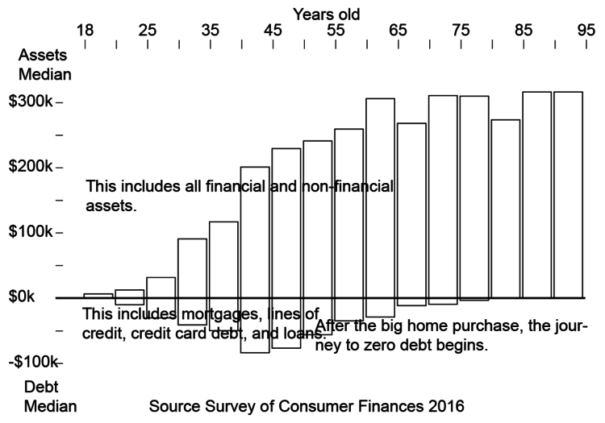

---@class:middle,center,inverse@@# Data visualization

## Visualization for analysis

- Tool for understanding datasets
- You ask questions and quickly answer them
- Iterate to develop insights.

## Context is important

A data visualization should be self-contained and be able to express the **context** of the data. 

This makes the visualization **informative**.


This chart is not novel or fancy, but the annotations make it relevant and contextual

## Improve readability

Data visualizations should be readable. It should be obvious what the chart is about and how to interpret it.




## Some ideas

- Your visualization depends on your audience
    + If the audience is your lab group (has a similar contextual background), then you may not have to provide as much context in your visualization
    + If you audience is a conference or a journal reader, you probably need to have more detail and context within the visualization

- Your visualization needs to reflect the character of the data
    + Continuous <--> categorical <--> binary
    + Dates and times
    + Spatial data (may be related to objects other than maps, like cell structure or organisms)
    + Networked or co-related data

> Design is choice. The theory of the visual display of quantitative information consists of principles that generate design options and that guide choices among options. The principles should not be applied rigidly or in a peevish spirit; they are not logically or mathematically certain; and it is better to violate any principle than to place graceless or inelegant marks on paper. Most principles of design should be greeted with some skepticism, for word authority can dominate our vision, and we may come to see only through the lenses of word authority rather than with our own eyes.
>
> -- <cite>Edward Tufte, The Visual Display of Quantitative Data

## Tufte's Principles of Graphical Integrity

1. Show data variation, not design variation
1. Do not use graphics to quote data out of context
1. Use clear, detailed, thorough labelling.
1. Representation of numbers should be directly proportional to numerical quantities
1. Don't use more dimensions than the data require

## Tufte's Principles of Graphical Integrity

1. Show data variation, not design variation
   - Don't get fancy, let the data speak
1. Do not use graphics to quote data out of context
   - Maintain accuracy
1. Use clear, detailed, thorough labelling.
   - Use annotations to make your point
1. Representation of numbers should be directly proportional to numerical quantities
   - This is essential for fair representation
1. Don't use more dimensions than the data require
   - Be appropriate in use of 3D graphics, for example

## Tufte's Fundamental Principles of Design

   1. Show comparisons
   1. Show causality
   1. Use multivariate data
   1. Completely integrate modes (like text, images, numbers)
   1. Establish credibility
   1. Focus on content

## Nathan Yau's Seven Basic Rules for Making Charts and Graphs

   1. Check the data
   1. Explain encodings
   1. Label axes
   1. Include units
   1. Keep your geometry in check
   1. Include your sources
   1. Consider your audience

### 1) Check the data


* This should be obvious
* If your data is weak, your chart is weak
* Start with simple graphs to see if there are any outliers

### 2) Explain encodings


* Don't assume the reader knows what everything means
* Provide a legend
* Label shapes
* Explain color scales

### 3) Label axes


* Axes without labels or explanation are just decorationS
* Describe the scale (incremental, exponential, logarithmic?)
* Have axes values start at zero

### 4) Include units


* Numbers without units are meaningless
* Remove the guesswork

### 5) Keep your geometry in check


* This is something that is immediately noticeable
* Don't use area to compare two units unless they are an area. An increase in a unit squares the area.
* Tip: size circles and other 2D shapes by area, unless it's a bar chart

### 6) Include your sources


* This is another obvious one
* Always include the source of your data
* Makes your graphic more reputable
* Allows for others to dig deeper

### 7) Consider your audience


* What purpose do your charts have and who are they for?
* Avoid quirky fonts
* Make good design choices

---@class:middle,center,inverse@@# Data to graphics

## Visual encoding

The basic question in data visualization is how we transform data values into blobs of ink on paper, or more recently, pixels on a screen. 

> All data visualizations map data values into quantifiable features of the resulting graphic. We refer to these as *aesthetics*
>
> -- <cite>Fundamentals of Data Visualization by Claus O. Wilke</cite>

We can also refer to these as **visual encoding**, i.e., how we encode aspects of data visually

## Common aesthetics/encodings


## Common aesthetics/encodings

The choice of aesthetics often will be guided by the kind of data you're trying to visualize, as we said earlier

- Quantitative / continuous
- Categorical ordered
- Categorical unordered
- Time (dates, times, years)

## Common aesthetics/encodings

Type      | Encodings   | Notes
----------|-------------|------
Continuous|x, y, size, color, line width | sequential and divergent color scales|
Ordered categorical | x, y, size, shape, color, line type, line width | sequential and divergent color scales|
Unordered categorical | x, y, shape, color, line type | qualitative color scales |
Time | x, y | |

> Can you think of examples where we can encode data types with different kinds of visualizations?

---@class:middle,center,inverse@@# Statistical Data Visualization

## Statistical data visualization

In this class we will mainly be dealing with statistical data visualizations, rather than visualizing functions and fixed patterns.

The package **seaborn** will be our main high-level Python tool to enable us to do this.

## seaborn, pandas and matplotlib

- pandas is the main tool to prepare data for visualization. It also has some plotting capabilities
- seaborn is the main tool for statistical visualizations as a high-level tool
- matplotlib is the primary tool for static data visualization in Python
    - Create customizable plots
    - Very granular; can control almost all aspects of a graph


## seaborn, pandas and matplotlib

- Both **pandas** plotting and **seaborn** are built on top of **matplotlib**
- Both **pandas** plotting and **seaborn** allow the creation of data visualizations with simpler code
- You can use the capabilities of **matplotlib** to 
    - set up visualizations
    - customize visualizations
    - save visualizations

---@class:middle,center,inverse@@# Let's get started

## Setting up

We'll use this set of packages almost always for creating static visualizations meant for a paper, poster, or website


```python
import matplotlib as mpl
import matplotlib.pyplot as plt
import pandas as pd
import seaborn as sns

%matplotlib inline
plt.style.use("seaborn-whitegrid")
```

This will be the usual setup for the material this week

## Starting with basic pandas plots

With **pandas**, we can do quite a bit of basic statistical plotting.

It also allows us to see the direct relationship between the data and visualizations

We can plot from both `Series` and `DataFrame` objects

**pandas** was originally built to work with time series, so a tacit assumption underlying **pandas** plotting is that the index of the `DataFrame` or `Series` is a series of dates or times, and each column is data collected at each of these time points for a particular variable. So a `DataFrame` was assumed to be a set of time series, and the plotting tools were designed accordingly. However, we won't follow that assumption here, since a `DataFrame` is used much more richly in data science.

## Starting with basic pandas plots

Let's start by importing the _cars2018.csv_ into our session


```python
cars = pd.read_csv("data/cars2018.csv")
cars.head()
```


<div>
<style scoped>
    .dataframe tbody tr th:only-of-type {
        vertical-align: middle;
    }

    .dataframe tbody tr th {
        vertical-align: top;
    }

    .dataframe thead th {
        text-align: right;
    }
</style>
<table border="1" class="dataframe">
  <thead>
    <tr style="text-align: right;">
      <th></th>
      <th>Model</th>
      <th>Model Index</th>
      <th>Displacement</th>
      <th>Cylinders</th>
      <th>Gears</th>
      <th>Transmission</th>
      <th>MPG</th>
      <th>Aspiration</th>
      <th>Lockup Torque Converter</th>
      <th>Drive</th>
      <th>Max Ethanol</th>
      <th>Recommended Fuel</th>
      <th>Intake Valves Per Cyl</th>
      <th>Exhaust Valves Per Cyl</th>
      <th>Fuel injection</th>
    </tr>
  </thead>
  <tbody>
    <tr>
      <th>0</th>
      <td>Acura NSX</td>
      <td>57</td>
      <td>3.5</td>
      <td>6</td>
      <td>9</td>
      <td>Manual</td>
      <td>21</td>
      <td>Turbocharged/Supercharged</td>
      <td>Y</td>
      <td>All Wheel Drive</td>
      <td>10</td>
      <td>Premium Unleaded Required</td>
      <td>2</td>
      <td>2</td>
      <td>Direct ignition</td>
    </tr>
    <tr>
      <th>1</th>
      <td>ALFA ROMEO 4C</td>
      <td>410</td>
      <td>1.8</td>
      <td>4</td>
      <td>6</td>
      <td>Manual</td>
      <td>28</td>
      <td>Turbocharged/Supercharged</td>
      <td>Y</td>
      <td>2-Wheel Drive, Rear</td>
      <td>10</td>
      <td>Premium Unleaded Required</td>
      <td>2</td>
      <td>2</td>
      <td>Direct ignition</td>
    </tr>
    <tr>
      <th>2</th>
      <td>Audi R8 AWD</td>
      <td>65</td>
      <td>5.2</td>
      <td>10</td>
      <td>7</td>
      <td>Manual</td>
      <td>17</td>
      <td>Naturally Aspirated</td>
      <td>Y</td>
      <td>All Wheel Drive</td>
      <td>15</td>
      <td>Premium Unleaded Recommended</td>
      <td>2</td>
      <td>2</td>
      <td>Direct ignition</td>
    </tr>
    <tr>
      <th>3</th>
      <td>Audi R8 RWD</td>
      <td>71</td>
      <td>5.2</td>
      <td>10</td>
      <td>7</td>
      <td>Manual</td>
      <td>18</td>
      <td>Naturally Aspirated</td>
      <td>Y</td>
      <td>2-Wheel Drive, Rear</td>
      <td>15</td>
      <td>Premium Unleaded Recommended</td>
      <td>2</td>
      <td>2</td>
      <td>Direct ignition</td>
    </tr>
    <tr>
      <th>4</th>
      <td>Audi R8 Spyder AWD</td>
      <td>66</td>
      <td>5.2</td>
      <td>10</td>
      <td>7</td>
      <td>Manual</td>
      <td>17</td>
      <td>Naturally Aspirated</td>
      <td>Y</td>
      <td>All Wheel Drive</td>
      <td>15</td>
      <td>Premium Unleaded Recommended</td>
      <td>2</td>
      <td>2</td>
      <td>Direct ignition</td>
    </tr>
  </tbody>
</table>
</div>


---@class:middle,center,inverse@@# Visualizing one variable (Continuous)

## Histogram


```python
cars["MPG"].plot(kind="hist")
```


    <AxesSubplot:ylabel='Frequency'>


    

    


## Density plot


```python
cars["MPG"].plot(kind="kde")
```


    <AxesSubplot:ylabel='Density'>


    

    


## Box plot


```python
cars["MPG"].plot(kind="box")
```


    <AxesSubplot:>


    

    


---@class:middle,center,inverse@@# Visualizing one variable (categorical)

## Frequency barplot

For a frequency barplot, you need to do a bit of data summarization using **pandas**


```python
cars["Cylinders"].value_counts()
```


    4     502
    6     392
    8     195
    12     23
    3      21
    10      8
    5       2
    16      1
    Name: Cylinders, dtype: int64


## Frequency barplot


```python
cars["Cylinders"].value_counts().plot(kind="bar")
```


    <AxesSubplot:>


    

    


## Frequency barplot

To order the bars by their natural order, we can modify how `value_counts` is computed


```python
cars["Cylinders"].value_counts(sort=False).plot(kind="bar")
```


    <AxesSubplot:>


    

    


---@class:middle,center,inverse@@# Visualizing bivariate relationships

## Scatter plot (2 continuous variables)


```python
cars.plot(x="Displacement", y="MPG", kind="scatter")
```


    <AxesSubplot:xlabel='Displacement', ylabel='MPG'>


    

    


## Scatterplot matrix

You can look at inter-relationships between all the continuous variables in a dataset using a scatterplot matrix. We'll use the _penguins_ data, which we can load through the **seaborn** package.


```python
penguins = sns.load_dataset("penguins")
pd.plotting.scatter_matrix(penguins);
```


    array([[<AxesSubplot:xlabel='bill_length_mm', ylabel='bill_length_mm'>,
            <AxesSubplot:xlabel='bill_depth_mm', ylabel='bill_length_mm'>,
            <AxesSubplot:xlabel='flipper_length_mm', ylabel='bill_length_mm'>,
            <AxesSubplot:xlabel='body_mass_g', ylabel='bill_length_mm'>],
           [<AxesSubplot:xlabel='bill_length_mm', ylabel='bill_depth_mm'>,
            <AxesSubplot:xlabel='bill_depth_mm', ylabel='bill_depth_mm'>,
            <AxesSubplot:xlabel='flipper_length_mm', ylabel='bill_depth_mm'>,
            <AxesSubplot:xlabel='body_mass_g', ylabel='bill_depth_mm'>],
           [<AxesSubplot:xlabel='bill_length_mm', ylabel='flipper_length_mm'>,
            <AxesSubplot:xlabel='bill_depth_mm', ylabel='flipper_length_mm'>,
            <AxesSubplot:xlabel='flipper_length_mm', ylabel='flipper_length_mm'>,
            <AxesSubplot:xlabel='body_mass_g', ylabel='flipper_length_mm'>],
           [<AxesSubplot:xlabel='bill_length_mm', ylabel='body_mass_g'>,
            <AxesSubplot:xlabel='bill_depth_mm', ylabel='body_mass_g'>,
            <AxesSubplot:xlabel='flipper_length_mm', ylabel='body_mass_g'>,
            <AxesSubplot:xlabel='body_mass_g', ylabel='body_mass_g'>]],
          dtype=object)


    

    


## Box plots (continuous x categorical)


```python
cars.boxplot(column="MPG", by="Cylinders");
```


    <AxesSubplot:title={'center':'MPG'}, xlabel='Cylinders'>


    

    


---@class:middle,center,inverse@@# An aside about pandas plotting

## Plotting several columns in a DataFrame

Because **pandas** was created to deal with sets of time series, the plotting rules were set up to encode each column into a separate visualization

For example, if you want to look at univariate characteristics of all continuous variables in a DataFrame:


```python
penguins.plot(kind="kde");
```


    <AxesSubplot:ylabel='Density'>


    

    


## Plotting several columns in a DataFrame

We'd do better by putting each variable into a separate plot


```python
penguins.plot(kind="kde", subplots=True);
```


    array([<AxesSubplot:ylabel='Density'>, <AxesSubplot:ylabel='Density'>,
           <AxesSubplot:ylabel='Density'>, <AxesSubplot:ylabel='Density'>],
          dtype=object)


    

    


## Plotting several columns in a DataFrame

Let's put each subplot on its own scale


```python
penguins.plot(kind="kde", subplots=True, sharex=False, layout=(2, 2));
```


    array([[<AxesSubplot:ylabel='Density'>, <AxesSubplot:ylabel='Density'>],
           [<AxesSubplot:ylabel='Density'>, <AxesSubplot:ylabel='Density'>]],
          dtype=object)


    

    


## Boxplots of several columns


```python
penguins[["bill_length_mm", "bill_depth_mm", "flipper_length_mm"]].plot(kind="box");
```


    

    


## Plotting against the index of a Series or DataFrame

With time series, **pandas** stores the time aspect in the index of the `Series` or `DataFrame`. So typically, **pandas** plots each variable against the index for encodings like line plots or bar plots

We saw this in the frequency bar plot, where `value_counts` creates a `Series` with unique values as the index and the values as the frequencies


```python
freqs = penguins["species"].value_counts()

freqs.index
```


    Index(['Adelie', 'Gentoo', 'Chinstrap'], dtype='object')


```python
freqs.values
```


    array([152, 124,  68])


```python
penguins["species"].value_counts().plot(kind="bar")
plt.show()
```


    

    


## Another example


```python
import numpy as np

n = np.random.randn(5, 4)
D = pd.DataFrame(n, columns=["A", "B", "C", "D"])
D.head()
```


<div>
<style scoped>
    .dataframe tbody tr th:only-of-type {
        vertical-align: middle;
    }

    .dataframe tbody tr th {
        vertical-align: top;
    }

    .dataframe thead th {
        text-align: right;
    }
</style>
<table border="1" class="dataframe">
  <thead>
    <tr style="text-align: right;">
      <th></th>
      <th>A</th>
      <th>B</th>
      <th>C</th>
      <th>D</th>
    </tr>
  </thead>
  <tbody>
    <tr>
      <th>0</th>
      <td>-0.383480</td>
      <td>0.829288</td>
      <td>0.381476</td>
      <td>2.407786</td>
    </tr>
    <tr>
      <th>1</th>
      <td>-0.137275</td>
      <td>2.494902</td>
      <td>-1.366498</td>
      <td>0.963358</td>
    </tr>
    <tr>
      <th>2</th>
      <td>-0.504763</td>
      <td>0.851114</td>
      <td>-0.977248</td>
      <td>0.290317</td>
    </tr>
    <tr>
      <th>3</th>
      <td>1.817811</td>
      <td>-0.275058</td>
      <td>-1.492786</td>
      <td>-0.004308</td>
    </tr>
    <tr>
      <th>4</th>
      <td>-1.062513</td>
      <td>0.430877</td>
      <td>0.548559</td>
      <td>-1.141157</td>
    </tr>
  </tbody>
</table>
</div>


```python
D.plot(kind="line")
```


    <AxesSubplot:>


    

    


So we can plot multiple variables on a plot (but does it make sense?)

---@class:middle,center,inverse@@# seaborn for statistical visualization

## seaborn

Using **pandas**, we see basic encodings, basically just `x` and `y`

**seaborn** gets us a richer set of visual encodings, using relatively straightforward code.

We'll see later how we'd do a similar plot using more granular code from **matplotlib**

## seaborn

The main classes of figures created using **seaborn**: 


## seaborn

**seaborn** allows us to make it easier to create 

- _facets_, i.e., subplots based on unique values of column(s) of the `DataFrame`
- _overlays_, i.e., plots where we can encode unique values of column(s) of a `DataFrame` on the same plot

## seaborn

**seaborn** code follows a general paradigm, where we

- start with a `DataFrame`
- specify the column(s) we want to plot
- specify the column(s) we want to either facet or overlay
- specify the encodings  for the different data elements


```python
sns.set_style("white", {"font.family": "Futura"})
```

## Histograms


```python
sns.displot(
    data=penguins,  # DataFrame
    x="bill_length_mm",  # columns to encode
    kind="hist",  # Type of encoding
)
```


    <seaborn.axisgrid.FacetGrid at 0x7fa795e169d0>


    

    


```python
sns.displot(
    data=penguins,  # DataFrame
    x="bill_length_mm",  # columns to encode
    kind="hist",  # Type of encoding
    hue="species",  # Encode species as colors (hue) and overlay
)
```


    <seaborn.axisgrid.FacetGrid at 0x7fa7955b1250>


    

    


## Histograms


```python
sns.displot(
    data=penguins,  # DataFrame
    x="bill_length_mm",  # columns to encode
    kind="hist",  # Type of encoding
    col="species",  # Encode species as facets, one per column
)
```


    <seaborn.axisgrid.FacetGrid at 0x7fa79501a3d0>


    

    


```python
sns.displot(
    data=penguins,  # DataFrame
    x="bill_length_mm",  # columns to encodeS
    kind="hist",  # Type of encoding
    col="species",  # Encode species as facets, one per row
    col_wrap=2,
    height=2.5,
    aspect=1.5,
)
```


    <seaborn.axisgrid.FacetGrid at 0x7fa796940fa0>


    

    


## Density plot


```python
sns.displot(data=penguins, x="bill_length_mm", hue="species", kind="kde")
```


    <seaborn.axisgrid.FacetGrid at 0x7fa796d3f130>


    

    


## Empirical cumulative distribution plots


```python
sns.displot(data=penguins, x="bill_length_mm", hue="species", kind="ecdf")
plt.show()
```


    

    


## Categorical plots


```python
sns.catplot(data=penguins, x="species", kind="count")
```


    <seaborn.axisgrid.FacetGrid at 0x7fa796daa910>


    

    


## Relating two continuous variables


```python
sns.relplot(data=penguins, x="bill_length_mm", y="body_mass_g");
```


    <seaborn.axisgrid.FacetGrid at 0x7fa797165910>


    

    


```python
sns.relplot(data=penguins, x="bill_length_mm", y="body_mass_g", hue="species");
```


    <seaborn.axisgrid.FacetGrid at 0x7fa7973d83d0>


    

    


```python
sns.relplot(
    data=penguins,
    x="bill_length_mm",
    y="body_mass_g",
    hue="species",
    style="species",
)
```


    <seaborn.axisgrid.FacetGrid at 0x7fa79715b970>


    

    


```python
sns.relplot(
    data=penguins,
    x="bill_length_mm",
    y="body_mass_g",
    hue="species",
    style="species",
    col="island",
)
```


    <seaborn.axisgrid.FacetGrid at 0x7fa7973d1cd0>


    

    


```python
sns.relplot(
    data=penguins,
    x="bill_length_mm",
    y="body_mass_g",
    hue="species",
    style="species",
    col="island",
)
```


    <seaborn.axisgrid.FacetGrid at 0x7fa796db5250>


    

    


```python
sns.relplot(
    data=penguins,
    x="bill_length_mm",
    y="body_mass_g",
    hue="species",
    style="species",
    col="island",
    col_wrap=2,
    col_order=["Biscoe", "Dream", "Torgersen"],
    height=3,
    aspect=1.5,
)
```


    <seaborn.axisgrid.FacetGrid at 0x7fa7980f09a0>


    

    


## Line plots


```python
fmri = sns.load_dataset("fmri")
fmri.head()
```


<div>
<style scoped>
    .dataframe tbody tr th:only-of-type {
        vertical-align: middle;
    }

    .dataframe tbody tr th {
        vertical-align: top;
    }

    .dataframe thead th {
        text-align: right;
    }
</style>
<table border="1" class="dataframe">
  <thead>
    <tr style="text-align: right;">
      <th></th>
      <th>subject</th>
      <th>timepoint</th>
      <th>event</th>
      <th>region</th>
      <th>signal</th>
    </tr>
  </thead>
  <tbody>
    <tr>
      <th>0</th>
      <td>s13</td>
      <td>18</td>
      <td>stim</td>
      <td>parietal</td>
      <td>-0.017552</td>
    </tr>
    <tr>
      <th>1</th>
      <td>s5</td>
      <td>14</td>
      <td>stim</td>
      <td>parietal</td>
      <td>-0.080883</td>
    </tr>
    <tr>
      <th>2</th>
      <td>s12</td>
      <td>18</td>
      <td>stim</td>
      <td>parietal</td>
      <td>-0.081033</td>
    </tr>
    <tr>
      <th>3</th>
      <td>s11</td>
      <td>18</td>
      <td>stim</td>
      <td>parietal</td>
      <td>-0.046134</td>
    </tr>
    <tr>
      <th>4</th>
      <td>s10</td>
      <td>18</td>
      <td>stim</td>
      <td>parietal</td>
      <td>-0.037970</td>
    </tr>
  </tbody>
</table>
</div>


```python
sns.relplot(data=fmri, x="timepoint", y="signal", kind="line")
```


    <seaborn.axisgrid.FacetGrid at 0x7fa798554d00>


    

    


```python
sns.relplot(data=fmri, x="timepoint", y="signal", kind="line", hue="event")
```


    <seaborn.axisgrid.FacetGrid at 0x7fa7985934c0>


    

    


```python
sns.relplot(
    data=fmri, x="timepoint", y="signal", kind="line", hue="event", style="region"
)
```


    <seaborn.axisgrid.FacetGrid at 0x7fa79886b880>


    

    


```python
sns.relplot(
    data=fmri,
    x="timepoint",
    y="signal",
    kind="line",
    hue="event",
    style="region",
    ci=None,
)
```


    <seaborn.axisgrid.FacetGrid at 0x7fa798902730>


    

    


```python
sns.lmplot(
    data=penguins,
    x="bill_length_mm",
    y="body_mass_g",
)
```


    <seaborn.axisgrid.FacetGrid at 0x7fa79856fd30>


    

    


```python
sns.lmplot(
    data=penguins,
    x="bill_length_mm",
    y="body_mass_g",
    lowess=True,
)
```


    <seaborn.axisgrid.FacetGrid at 0x7fa798e42310>


    

    


```python
sns.lmplot(
    data=penguins,
    x="bill_length_mm",
    y="body_mass_g",
    hue="species",
)
```


    <seaborn.axisgrid.FacetGrid at 0x7fa7990da2e0>


    

    


## Categorical plots


```python
diamonds = sns.load_dataset("diamonds")
diamonds.shape
```


    (53940, 10)


```python
sns.catplot(data=diamonds, x="cut", y="price", kind="box")
```


    <seaborn.axisgrid.FacetGrid at 0x7fa798bfe910>


    

    


```python
cat_order = ["Fair", "Good", "Very Good", "Premium", "Ideal"]
sns.catplot(
    data=diamonds,
    x="cut",
    y="price",
    kind="strip",
    order=cat_order,
)
```


    <seaborn.axisgrid.FacetGrid at 0x7fa79925deb0>


    

    


```python
cat_order = ["Fair", "Good", "Very Good", "Premium", "Ideal"]
sns.catplot(
    data=diamonds,
    x="cut",
    y="price",
    kind="bar",
    order=cat_order,
)
```


    <seaborn.axisgrid.FacetGrid at 0x7fa79ac02eb0>


    

    


## Pair plot


```python
sns.pairplot(data=penguins)
```


    <seaborn.axisgrid.PairGrid at 0x7fa79adf8f70>


    

    


```python
sns.pairplot(data=penguins, hue="species")
```


    <seaborn.axisgrid.PairGrid at 0x7fa77ce64190>


    

    


```python
g = sns.PairGrid(penguins, diag_sharey=False)
g.map_upper(sns.scatterplot)
g.map_lower(sns.kdeplot)
g.map_diag(sns.kdeplot, lw=2)
```


    <seaborn.axisgrid.PairGrid at 0x7fa77ce9bd30>


## Joint plot


```python
sns.jointplot(data=penguins, x="flipper_length_mm", y="bill_length_mm", hue="species")
```

## Overlaying aesthetics


```python
g = sns.catplot(data=penguins, x="species", y="body_mass_g", kind="violin")
sns.swarmplot(data=penguins, x="species", y="body_mass_g", ax=g.ax, color="black")
g.set_xlabels("Species")
g.set_ylabels("Body mass (g)")
```

---@class:middle,center,inverse@@# matplotlib

## Granular control

**matplotlib** allows us a lot of granular control of a data visualization.

We can build a visualization from the ground up


```python
fig, ax = plt.subplots()
ax.scatter(penguins["bill_length_mm"], penguins["body_mass_g"])
ax.set_xlabel("Bill length (mm)")
ax.set_ylabel("Body mass (g)")
```


```python
fig, ax = plt.subplots()
cols = ["red", "blue", "green"]
for i, u in enumerate(penguins["species"].unique()):
    d = penguins[penguins["species"] == u]
    ax.scatter(d["bill_length_mm"], d["body_mass_g"], c=cols[i], label=u)
ax.legend(title="Species", loc="best", labelcolor="black")
plt.show()
```


```python
fig, axs = plt.subplots(nrows=1, ncols=3, sharex=True, sharey=True, figsize=[15, 5])
cols = ["red", "blue", "green"]
for i, u in enumerate(penguins["species"].unique()):
    d = penguins[penguins["species"] == u]
    axs[i].scatter(d["bill_length_mm"], d["body_mass_g"], c=cols[i], label=u)
    axs[i].set_title(u)
    axs[i].set_xlabel("Bill length(mm)")
    if i == 0:
        axs[i].set_ylabel("Body mass (g)")
fig.legend()
```


```python
g = sns.relplot(
    data=penguins, x="bill_length_mm", y="body_mass_g", col="species", hue="species"
)
g.set_xlabels("Bill length (mm)")
g.set_ylabels("Body mass (g)")
plt.show()
```

---@class:middle,center,inverse@@# Saving your work

**matplotlib**, and, by extension, **pandas** and **seaborn**, has a large number of backend engines that enables one to save their visualizations in several file formats. 


```python
print(pd.Series(fig.canvas.get_supported_filetypes()))
```

---@class:middle,center,inverse@@# Saving your work

You can save your work using the `plt.savefig` function


```python
---@class:middle,center,inverse@@# This will save the last run figure
plt.savefig("penguins.png", transparent=True, dpi=300)
```


```python
---@class:middle,center,inverse@@# This will save the figure contained in fig
fig.savefig("penguins.png", transparent=True, dpi=300)
```


```python
!ls -l
```
