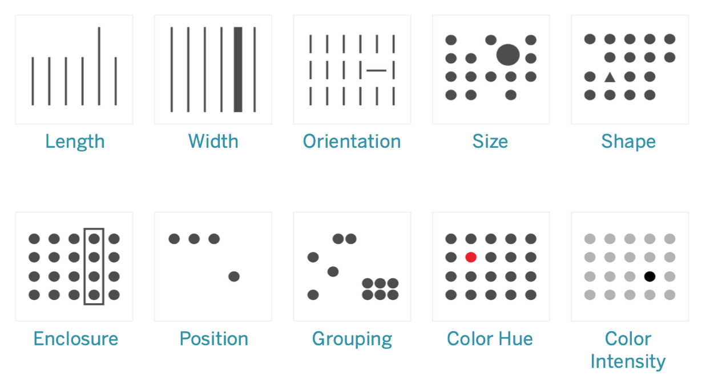

```{r, include=F, child='../css/setup.Rmd'}

```
```{r, include=F}
knitr::opts_chunk$set(cache=FALSE, echo=T, eval=F)
```

```{python, echo=F, eval=F}
import plotly
from IPython.display import IFrame, display_html


def show_fig(fig, filename, width="100%", height=500):
    plotly.offline.plot(fig, filename=filename, auto_open=False, auto_play=False)
    display_html(IFrame(filename, height=height, width=width))

def show_fig2(filename, width="100%", height=500):
    display_html(IFrame(filename, width=width, height=height))

```

---

## Why dynamic/interactive data visualizations

- Traditional data visualizations have been meant for print
    - Journals
    - Magazines
    - Reports
    - Billboards

---

## Why dynamic/interactive data visualizations

- Media for data reporting has changed to the web
    - websites
    - blogs
    - digital paper
    - electronic billboards
- The web is fundamentally an interactive medium
    - Point and click
    - Explore through links
    - Movement
   

 
---

## Why dynamic/interactive data visualizations

- In 1984, Apple introduced a personal computer operating via graphical interaction and display
- This innovation led to widespread availability of personal affordable computers on which we can view and interact with graphics
- Ability to create data visualizations became easy, but was commonly done poorly

.footnote[Stephen Few, [*Data Visualization: Past, Present and Future*](https://www.perceptualedge.com/articles/Whitepapers/Data_Visualization.pdf), 2007]

---


## Visual analytics

- The science of analytical reasoning facilitated by interactive visual interfaces (Thomas & Cook, 2005)
- Helps with visualizing **and analyzing** data
    - Summarize data
    - Dig deeper
    - Provide analytic insights, cause-and-effect
    - Compressing information from large corpuses of data into small spaces

---

## Visual analytics

- Represent data graphically
- Interact with those visual representations
    - change the nature of the display, 
    - filter out what’s not relevant, 
    - drill into lower levels of detail, 
    - highlight subsets of data across multiple graphs simultaneously. 
    
.footnote[Tableau, [*Why Visual Analytics?*](https://help.tableau.com/current/blueprint/en-us/bp_why_visual_analytics.htm)]

---

## Visual analytics

We will still use principles of good visual encodings

- colors
- shapes/markers
- ink ratio
- size

We can add

- tooltips
- on/off mechanisms
- facets

---

## Visual analytics

As a reminder, we'll still use the usual geometries to encode data



---

## Visual analytics

### Kinds of interactions

1. Scroll and pan
1. Zoom
1. Open and close
1. Sort and re-arrange
1. Search and filter

.footnote[Jennifer Tidwell]

---

## Visual analytics

Ben Schneiderman proposed principles for interactive/dynamic graphics

1. Overview first
1. Zoom and filter
1. Details on demand

--

This can be translated as

1. Give an overview of the data in a single plot
1. Zoom, select, and move around in the space of the plot
1. Add information (meta-data), usually through tooltips

---

## Visual analytics

The **treemap** is one of the first interactive tools moving from research to business (Ben Schneiderman)

- display up to two different quantitative variables at different levels of a hierarchy


```{python,echo=F, eval=F}
import numpy as np
import plotly
import plotly.express as px

df = px.data.gapminder().query("year == 2007")
df["world"] = "world"  # in order to have a single root node
fig = px.treemap(
    df,
    path=["world", "continent", "country"],
    values="pop",
    color="lifeExp",
    hover_data=["iso_alpha"],
    color_continuous_scale="RdBu",
    color_continuous_midpoint=np.average(df["lifeExp"], weights=df["pop"]),
)
show_fig(fig, "week4_files/treemap1.html")
```


<iframe
    width="100%"
    height="500"
    src="week4_files/treemap1.html"
    frameborder="0"
    allowfullscreen
></iframe>


---

## Visual analytics

The Gapminder data, made famous by Hans Rosling, provides an opportunity to show an example of several aspects of interactive data visualization


```{python, echo=F, eval=F}
gapm = px.data.gapminder()
fig = px.scatter(
    gapm,
    x="gdpPercap",
    y="lifeExp",
    animation_frame="year",
    animation_group="country",
    size="pop",
    color="continent",
    hover_name="country",
    log_x=True,
    size_max=55,
    range_x=[100, 100000],
    range_y=[25, 90],
)
show_fig(fig, "week4_files/gap1.html", width="100%", height=500)
```


<iframe
    width="100%"
    height="500"
    src="week4_files/gap1.html"
    frameborder="0"
    allowfullscreen
></iframe>


---

## Visual analytics

The most popular application for dynamic data visualization is [Tableau](https://www.tableau.com). 

However, using Python, or R, or other programming languages to create these visualizations allows you to unify the data science pipeline that includes description, analysis and visualization

---
class:middle,center,inverse

# Interactive/dynamic data visualizations in Python

---

## A caveat

In this module we won't talk about animations, i.e., a sequence of graphics that show a flow of data over time. That is dynamic, but not necessarily interactive. 

We will look briefly at animations later in the term

---

## Python packages for interactive visualizations

The main packages for interactive visualizations in Python are 

1. [plotly](https://plotly.com/python/)
1. [bokeh](https://bokeh.pydata.org)
1. [altair](https://altair-viz.github.io/)

In addition, there are several others, including mpld3 (using d3.js), pygal, and holoviews.

---

## Python packages for interactive graphics

We will explore **plotly** and **altair** in this class. In week 6 we'll provide resources for **bokeh** and using **holoviews** to create graphics using **matplotlib**, **bokeh** and **plotly**

Both **plotly** and **altair** have a coding schema (API) that makes the mappings from the data to the visualization explicit, leading to an easier mental model for creating interactive graphics

---

## Setting up Python


```python
import altair as alt
import matplotlib.pyplot as plt
import numpy as np
import pandas as pd
import plotly
import plotly.express as px
import plotly.figure_factory as ff
import plotly.graph_objects as go
import seaborn as sns
```

---
class:middle,center,inverse

# plotly

---

## plotly

**plotly.js** is a popular Javascript-based interactive visualization library based on **d3.js**

The company behind **plotly.js** developed both Python and R interfaces to create interactive graphics using **plotly.js**

We'll concentrate here on statistical visualizations using **plotly**, but the documentation will show many other kinds of graphics that can be generated.

---

## plotly

The Python interface to **plotly** includes two tracks

- a granular interface using `plotly.graph_objects`
- a higher-level interface using `plotly.express`

Often it's easier to start a graphic with `plotly.express`, and then customize it with elements from `plotly.graph_objects`. 

---

## plotly

We'll start with examples using the panguins data, which we will grab from the **seaborn** package as a **pandas** `DataFrame`


```python
penguins = sns.load_dataset("penguins")
penguins.head()
```


<div>
<style scoped>
    .dataframe tbody tr th:only-of-type {
        vertical-align: middle;
    }

    .dataframe tbody tr th {
        vertical-align: top;
    }

    .dataframe thead th {
        text-align: right;
    }
</style>
<table border="1" class="dataframe">
  <thead>
    <tr style="text-align: right;">
      <th></th>
      <th>species</th>
      <th>island</th>
      <th>bill_length_mm</th>
      <th>bill_depth_mm</th>
      <th>flipper_length_mm</th>
      <th>body_mass_g</th>
      <th>sex</th>
    </tr>
  </thead>
  <tbody>
    <tr>
      <th>0</th>
      <td>Adelie</td>
      <td>Torgersen</td>
      <td>39.1</td>
      <td>18.7</td>
      <td>181.0</td>
      <td>3750.0</td>
      <td>Male</td>
    </tr>
    <tr>
      <th>1</th>
      <td>Adelie</td>
      <td>Torgersen</td>
      <td>39.5</td>
      <td>17.4</td>
      <td>186.0</td>
      <td>3800.0</td>
      <td>Female</td>
    </tr>
    <tr>
      <th>2</th>
      <td>Adelie</td>
      <td>Torgersen</td>
      <td>40.3</td>
      <td>18.0</td>
      <td>195.0</td>
      <td>3250.0</td>
      <td>Female</td>
    </tr>
    <tr>
      <th>3</th>
      <td>Adelie</td>
      <td>Torgersen</td>
      <td>NaN</td>
      <td>NaN</td>
      <td>NaN</td>
      <td>NaN</td>
      <td>NaN</td>
    </tr>
    <tr>
      <th>4</th>
      <td>Adelie</td>
      <td>Torgersen</td>
      <td>36.7</td>
      <td>19.3</td>
      <td>193.0</td>
      <td>3450.0</td>
      <td>Female</td>
    </tr>
  </tbody>
</table>
</div>


---

## plotly

Let's start with a basic scatterplot

.pull-left[
```{python}
fig = px.scatter(
    data_frame=penguins, 
    x="bill_length_mm", 
    y="body_mass_g", 
    template="simple_white"
)

show_fig(fig, "week4_files/scatter1.html")
```
]
.pull-right[


<iframe
    width="100%"
    height="500"
    src="week4_files/scatter1.html"
    frameborder="0"
    allowfullscreen
></iframe>

]

Note that we can mouse over points to get some information, in this case, the x- and y-coordinates

---

## plotly

We'll now add _species_ encoded as color

.pull-left[
```{python}
fig = px.scatter(
    data_frame=penguins,
    x="bill_length_mm",
    y="body_mass_g",
    color="species",  # <<
    template="simple_white",
)
show_fig(fig, "week4_files/scatter2.html")
```
]
.pull-right[


<iframe
    width="100%"
    height="500"
    src="week4_files/scatter2.html"
    frameborder="0"
    allowfullscreen
></iframe>

]

Note that **plotly** provides pan, zoom, on/off, select and tooltips automatically

---

## plotly

We can also add marginal plots with additional arguments

.pull-left[
```{{python}
fig = px.scatter(
    penguins,
    x="bill_length_mm",
    y="body_mass_g",
    color="species",
    marginal_x="box",  # <<
    marginal_y="violin",  # <<
    template="simple_white",
)
show_fig(fig, "week4_files/scatter3.html")
```
]
.pull-right[


<iframe
    width="100%"
    height="500"
    src="week4_files/scatter3.html"
    frameborder="0"
    allowfullscreen
></iframe>
]


---

## plotly

Add regression lines

.pull-left[
```{python}
fig = px.scatter(
    data_frame=penguins,
    x="bill_length_mm",
    y="body_mass_g",
    color="species",
    marginal_x="box",
    marginal_y="violin",
    trendline="lowess",  # <<
    template="simple_white",
)
show_fig(fig, "week4_files/scatter4.html")
```
]
.pull-right[


<iframe
    width="100%"
    height="500"
    src="week4_files/scatter4.html"
    frameborder="0"
    allowfullscreen
></iframe>

]

---

## plotly

Add regression lines

.pull-left[
```{python}
fig = px.scatter(
    data_frame=penguins,
    x="bill_length_mm",
    y="body_mass_g",
    color="species",
    marginal_x="box",
    marginal_y="violin",
    trendline="ols",  # <<
    template="simple_white",
)
show_fig(fig, filename="week4_files/scatter5.html")
```

]
.pull-right[

<iframe
    width="100%"
    height="500"
    src="week4_files/scatter5.html"
    frameborder="0"
    allowfullscreen
></iframe>

]

---

## plotly

We can also do trellis graphics pretty easily using **plotly**

.pull-left[

```{python}
fig = px.scatter(
    data_frame=penguins,
    x="bill_length_mm",
    y="body_mass_g",
    color="species",
    facet_col="species",  # <<
    template="simple_white",
)
show_fig(fig, filename="week4_files/scatter6.html")
```

]
.pull-right[

<iframe
    width="100%"
    height="500"
    src="week4_files/scatter6.html"
    frameborder="0"
    allowfullscreen
></iframe>
]


---

## plotly

.pull-left[
```{python}
fig = px.scatter(
    data_frame=penguins,
    x="bill_length_mm",
    y="body_mass_g",
    color="species",
    facet_col="species",  # <<
    facet_col_wrap=2,  # <<
    template="simple_white",
)
show_fig(fig, filename="week4_files/scatter7.html")
```
]
.pull-right[


<iframe
    width="100%"
    height="500"
    src="week4_files/scatter7.html"
    frameborder="0"
    allowfullscreen
></iframe>

]

---

## plotly

We can clean up the plot

.pull-left[
```{python}
fig = px.scatter(
    data_frame=penguins,
    x="bill_length_mm",
    y="body_mass_g",
    color="species",
    facet_col="species",
    facet_col_wrap=2,  # <<b
    template="simple_white",
    labels={
        "body_mass_g": "Body mass (g)",
        "bill_length_mm": "Bill length (mm)",
        "species": "Species",
    },
)
show_fig(fig, filename="week4_files/scatter8.html")
```
]
.pull-right[


<iframe
    width="100%"
    height="500"
    src="week4_files/scatter8.html"
    frameborder="0"
    allowfullscreen
></iframe>


]

---
class:middle,center,inverse

# Tooltips

---

## Tooltips

You can add data from column(s) of the DataFrame as tooltips quite easily

.pull-left[
```python
fig = px.scatter(
    data_frame=penguins,
    x="bill_length_mm",
    y="body_mass_g",
    color="species",
    facet_col="species",
    facet_col_wrap=2,  # <<b
    template="simple_white",
    labels={
        "body_mass_g": "Body mass (g)",
        "bill_length_mm": "Bill length (mm)",
        "species": "Species",
    },
    hover_name="island",  # <<
)
show_fig(fig, filename="week4_files/scatter9.html")
```

]
.pull-right[

<iframe
    width="100%"
    height="500"
    src="week4_files/scatter9.html"
    frameborder="0"
    allowfullscreen
></iframe>

]

---

## Tooltips

Choose which variables go into the tooltip

.pull-left[
```python
fig = px.scatter(
    data_frame=penguins,
    x="bill_length_mm",
    y="body_mass_g",
    color="species",
    facet_col="species",
    facet_col_wrap=2,  # <<b
    template="simple_white",
    labels={
        "body_mass_g": "Body mass (g)",
        "bill_length_mm": "Bill length (mm)",
        "species": "Species",
    },
    hover_data={
        "island": True,
        "species": False,
        "bill_length_mm": False,
        "body_mass_g": False,
    },  # <<
)
show_fig(fig, filename="week4_files/scatter10.html")
```
]
.pull-right[


<iframe
    width="100%"
    height="500"
    src="week4_files/scatter10.html"
    frameborder="0"
    allowfullscreen
></iframe>


]

---

## Tooltips

You can change the appearance of the tooltip

.pull-left[
```python
fig.update_layout(
  hoverlabel={
    "bgcolor": "red", 
    "font_family": "Futura"
    })
show_fig(fig, 
filename="week4_files/scatter11.html")
```

]
.pull-right[

<iframe
    width="100%"
    height="500"
    src="week4_files/scatter11.html"
    frameborder="0"
    allowfullscreen
></iframe>

]

---

## Tool tips

You can also provide a template for the tooltips

.pull-left[
```python
import plotly.express as px

df_2007 = (px.data.gapminder()
  .query("year==2007"))

fig = px.scatter(df_2007, 
  x="gdpPercap", 
  y="lifeExp", 
  log_x=True, 
  color="continent")

fig.update_traces(
  hovertemplate="GDP: %{x} <br>Life Expectancy: %{y}")  # <<
fig.update_traces(
    hovertemplate=None, selector={"name": "Europe"}
)  # revert to default hover
show_fig(fig, filename="week4_files/scatter12.html")
```
]
.pull-right[


<iframe
    width="100%"
    height="500"
    src="week4_files/scatter12.html"
    frameborder="0"
    allowfullscreen
></iframe>

]

---
class:middle,center,inverse

# Univariate plots

---

## Distributional plots


```python
fig = px.histogram(
    data_frame=penguins,
    x="body_mass_g",
)
fig.update_xaxes(title="Body mass (g)")
show_fig(fig, filename="week4_files/hist1.html")
```


<iframe
    width="100%"
    height="400"
    src="week4_files/hist1.html"
    frameborder="0"
    allowfullscreen
></iframe>


---

```python
fig = px.histogram(data_frame=penguins, x="body_mass_g", color="species")
show_fig(fig, filename="week4_files/hist2.html")
```


<iframe
    width="100%"
    height="400"
    src="week4_files/hist2.html"
    frameborder="0"
    allowfullscreen
></iframe>


---

```python
fig = px.histogram(
    data_frame=penguins, x="body_mass_g", color="species", marginal="violin"
)
show_fig(fig, filename="week4_files/hist3.html")
```


<iframe
    width="100%"
    height="300"
    src="week4_files/hist3.html"
    frameborder="0"
    allowfullscreen
></iframe>


---

## Density plots

We use a trick to create a density plot from a violin plot


```python
fig = px.violin(data_frame=penguins, x="body_mass_g")
fig.update_traces(orientation="h", side="positive")  # <<
show_fig(fig, filename="week4_files/density1.html")
```


---

## Density plots

<iframe
    width="100%"
    height="500"
    src="week4_files/density1.html"
    frameborder="0"
    allowfullscreen
></iframe>


---

## Density plots

The `plotly.express` and `plotly.graphical_object` paradigms don't currently create density plots. There is another function, `figure_factory`, that allows you to create density plots. These `figure_factory` are generally deprecated, but are kept to fill in gaps in other paradigms


```python
import plotly.figure_factory as ff

fig = ff.create_distplot(
    [penguins["body_mass_g"].dropna().to_list()],  # Need to get rid of missing data
    group_labels=["Body mass"],
    bin_size=100,
    show_hist=False,
    show_rug=False,
)
fig.update_yaxes(showticklabels=False)
fig.update_xaxes(title="Body mass")
fig.update_layout(showlegend=False, template="simple_white")
show_fig(fig, filename="week4_files/density2.html")
```
---

## Density plots

<iframe
    width="100%"
    height="500"
    src="week4_files/density2.html"
    frameborder="0"
    allowfullscreen
></iframe>


---

## Frequency bar plots


```python
d = penguins.island.value_counts().reset_index()

print(d)
```

           index  island
    0     Biscoe     168
    1      Dream     124
    2  Torgersen      52


```python
fig = px.bar(
    d,
    x="index",
    y="island",
    text="island",  # <<
    labels={"island": "Frequency", "index": "Island"},
    template="simple_white",
)
show_fig(fig, filename="week4_files/bar1.html")
```

---

## Frequency bar plots

<iframe
    width="100%"
    height="500"
    src="week4_files/bar1.html"
    frameborder="0"
    allowfullscreen
></iframe>


---

## Frequency bar plots

.pull-left[
```python
d = penguins.island.value_counts().reset_index()

fig = px.bar(
    d,
    x="index",
    y="island",
    text="island",  # <<
    labels={"island": "Frequency", 
      "index": "Island"},
    template="simple_white",
).update_layout(
    xaxis={"categoryorder": "category descending"},  # << Reverse alphabetical order
)
show_fig(fig, filename="week4_files/bar2.html")
```

]
.pull-right[

<iframe
    width="100%"
    height="500"
    src="week4_files/bar2.html"
    frameborder="0"
    allowfullscreen
></iframe>

]

---

## Frequency bar plots

.pull-left[
```python
d = penguins.island.value_counts().reset_index()

fig = px.bar(
    d,
    x="index",
    y="island",
    text="island",  # <<
    labels={"island": "Frequency", 
    "index": "Island"},
    template="simple_white",
).update_layout(
    xaxis={"categoryorder": 
      "total ascending"},  # <<  value order
)
show_fig(fig, filename="week4_files/bar3.html")
```
]
.pull-right[


<iframe
    width="100%"
    height="500"
    src="week4_files/bar3.html"
    frameborder="0"
    allowfullscreen
></iframe>


]

---

## Frequency bar plots

.pull-left[
```python
d = penguins.island.value_counts().reset_index()

fig = px.bar(
    d,
    x="index",
    y="island",
    text="island",  # <<
    labels={"island": "Frequency", "index": "Island"},
    template="simple_white",
).update_layout(
    xaxis={
        "categoryorder": "array",
        "categoryarray": ["Dream", "Torgersen", "Biscoe"],
    },  # Specify the order
)
show_fig(fig, filename="week4_files/bar4.html")
```

]
.pull-right[

<iframe
    width="100%"
    height="500"
    src="week4_files/bar4.html"
    frameborder="0"
    allowfullscreen
></iframe>


]

---
class:middle,center,inverse

# Grouped bar charts

---

## Stacked bar charts


```python
tips = px.data.tips()

fig = px.bar(data_frame=tips, x="day", y="total_bill", color="sex")
fig.update_layout(showlegend=False)
show_fig(fig, filename="week4_files/bar5.html")
```


<iframe
    width="100%"
    height="400"
    src="week4_files/bar5.html"
    frameborder="0"
    allowfullscreen
></iframe>


---

## Stacked bar charts


```python
tips_summary = tips.groupby(["day", "sex"])["total_bill"].sum().reset_index()
```
.pull-left[

```python
fig = px.bar(
    data_frame=tips_summary,
    x="day",
    y="total_bill",
    color="sex",
    category_orders={"day": ["Thur", "Fri", "Sat", "Sun"]},
    template="simple_white",
)
show_fig(fig, filename="week4_files/bar6.html")
```

]
.pull-right[

<iframe
    width="100%"
    height="500"
    src="week4_files/bar6.html"
    frameborder="0"
    allowfullscreen
></iframe>

]

---

## Grouped bar chart

.pull-left[
```python
fig = px.bar(
    data_frame=tips_summary,
    x="day",
    y="total_bill",
    color="sex",
    category_orders={"day": ["Thur", "Fri", "Sat", "Sun"]},
    barmode="group",
    template="simple_white",
)
show_fig(fig, filename="week4_files/bar7.html")
```

]
.pull-right[

<iframe
    width="100%"
    height="500"
    src="week4_files/bar7.html"
    frameborder="0"
    allowfullscreen
></iframe>

]


---

## Percent bar chart

For the percent bar chart you have to compute the percentages first before creating the bar charts.


```python
tips_summary["Percent"] = tips_summary.groupby(["day"])["total_bill"].apply(
    lambda x: x / float(x.sum())
)

tips_summary.head()
```


<div>
<style scoped>
    .dataframe tbody tr th:only-of-type {
        vertical-align: middle;
    }

    .dataframe tbody tr th {
        vertical-align: top;
    }

    .dataframe thead th {
        text-align: right;
    }
</style>
<table border="1" class="dataframe">
  <thead>
    <tr style="text-align: right;">
      <th></th>
      <th>day</th>
      <th>sex</th>
      <th>total_bill</th>
      <th>Percent</th>
    </tr>
  </thead>
  <tbody>
    <tr>
      <th>0</th>
      <td>Fri</td>
      <td>Female</td>
      <td>127.31</td>
      <td>0.390665</td>
    </tr>
    <tr>
      <th>1</th>
      <td>Fri</td>
      <td>Male</td>
      <td>198.57</td>
      <td>0.609335</td>
    </tr>
    <tr>
      <th>2</th>
      <td>Sat</td>
      <td>Female</td>
      <td>551.05</td>
      <td>0.309857</td>
    </tr>
    <tr>
      <th>3</th>
      <td>Sat</td>
      <td>Male</td>
      <td>1227.35</td>
      <td>0.690143</td>
    </tr>
    <tr>
      <th>4</th>
      <td>Sun</td>
      <td>Female</td>
      <td>357.70</td>
      <td>0.219831</td>
    </tr>
  </tbody>
</table>
</div>


---

## Percent bar chart

.pull-left[

```python
fig = px.bar(
    data_frame=tips_summary,
    x="day",
    y="Percent",
    color="sex",
    template="simple_white",
    category_orders={"day": ["Thur", "Fri", "Sat", "Sun"], 
      "sex": ["Male", "Female"]},
)
fig.update_layout(yaxis_tickformat="%")
show_fig(fig, filename="week4_files/bar8.html")
```

]
.pull-right[

<iframe
    width="100%"
    height="500"
    src="week4_files/bar8.html"
    frameborder="0"
    allowfullscreen
></iframe>


]

---

## plotly

### Scatterplot matrices


```python
penguins_labels = {
    "body_mass_g": "Body mass (g)",
    "bill_length_mm": "Bill length (mm)",
    "bill_depth_mm": "Bill depth (mm)",
    "flipper_length_mm": "Flipper length (mm)",
    "species": "Species",
    "island": "Island",
}

fig = px.scatter_matrix(
    data_frame=penguins,
    dimensions=["body_mass_g", "bill_length_mm", "bill_depth_mm", "flipper_length_mm"],
    color="species",
    labels=penguins_labels,
)
show_fig(fig, filename="week4_files/splom.html")
```

---

### Scatterplot matrices


<iframe
    width="100%"
    height="500"
    src="week4_files/splom.html"
    frameborder="0"
    allowfullscreen
></iframe>


---
class:middle,center,inverse

# Continuous vs categorical

---

## Boxplots 

.pull-left[
```python
fig = px.box(
    data_frame=penguins,
    x="species",
    y="body_mass_g",
    template="simple_white",
    labels=penguins_labels,
)
show_fig(fig, filename="week4_files/box1.html")
```

]
.pull-right[

<iframe
    width="100%"
    height="500"
    src="week4_files/box1.html"
    frameborder="0"
    allowfullscreen
></iframe>

]

---

## Violin plot

.pull-left[

```python
fig = px.violin(
    data_frame=penguins,
    x="species",
    y="body_mass_g",
    template="simple_white",
    labels=penguins_labels,
)
show_fig(fig, filename="week4_files/violin1.html")
```

]
.pull-right[

<iframe
    width="100%"
    height="500"
    src="week4_files/violin1.html"
    frameborder="0"
    allowfullscreen
></iframe>


]

---

## Strip plot

.pull-left[
```python
fig = px.strip(
    data_frame=penguins,
    x="body_mass_g",
    y="species",
    color="species",
    template="simple_white",
    labels=penguins_labels,
)
show_fig(fig, filename="week4_files/strip1.html")
```

]
.pull-right[

<iframe
    width="100%"
    height="500"
    src="week4_files/strip1.html"
    frameborder="0"
    allowfullscreen
></iframe>

]

---

## Grouped violin plots

.pull-left[
```python
fig = px.violin(data_frame=tips, 
  y="tip", 
  x="smoker", 
  color="sex", 
  box=True)
show_fig(fig, filename="week4_files/violin2.html")
```

]
.pull-right[

<iframe
    width="100%"
    height="500"
    src="week4_files/violin2.html"
    frameborder="0"
    allowfullscreen
></iframe>


]

---

## Parallel coordinates plot

For parallel coordinate plots, the categorical variable values **must** be transformed to numeric codes


```python
penguins.species.astype("category").cat.codes.value_counts(sort=False)
```


    0    152
    1     68
    2    124
    dtype: int64

---

## Parallel coordinates plot


```python
penguins["species_id"] = penguins.species.astype("category").cat.codes  # <<
fig = px.parallel_coordinates(
    penguins,
    dimensions=["body_mass_g", "bill_length_mm", "bill_depth_mm", "flipper_length_mm"],
    color="species_id",
)
show_fig(fig, filename="week4_files/parallel.html")
```


<iframe
    width="100%"
    height="350"
    src="week4_files/parallel.html"
    frameborder="0"
    allowfullscreen
></iframe>

---

## Treemap


```python
df = px.data.gapminder().query("year == 2007")
df["world"] = "world"  # in order to have a single root node
fig = px.treemap(
    df,
    path=["world", "continent", "country"],  # << sets hierarchy
    values="pop",
    color="lifeExp",
    hover_data=["iso_alpha"],
    color_continuous_scale="RdBu",
    color_continuous_midpoint=np.average(df["lifeExp"], weights=df["pop"]),
)
show_fig(fig, filename="week4_files/treemap1.html")
```

---

## Treemap


<iframe
    width="100%"
    height="500"
    src="week4_files/treemap1.html"
    frameborder="0"
    allowfullscreen
></iframe>


---
class:middle,center,inverse

# More dynamism

---

## Sliders

```python
gapm = px.data.gapminder()
fig = px.scatter(
    gapm,
    x="gdpPercap",
    y="lifeExp",
    animation_frame="year",  # <<
    animation_group="country",  # <<
    size="pop",
    color="continent",
    hover_name="country",
    log_x=True,
    size_max=55,
    range_x=[100, 100000],
    range_y=[25, 90],
)
show_fig(fig, filename="week4_files/gap1.html")
```

---

## Sliders

<iframe
    width="100%"
    height="500"
    src="week4_files/gap1.html"
    frameborder="0"
    allowfullscreen
></iframe>


---
class:middle,center,inverse

# Altair

---

## Altair

Altair provides a wrapper around the Vega-Lite Javascript library, which is based on the famous d3.js. 

It provides a syntax that explicitly describes the visual encodings that will be put on a plot. 

This syntax is different from plotly, but it is clear in its own way.

---

## Altair


```python
import altair as alt

mpg = sns.load_dataset("mpg")
mpg.head()
```


<div>
<style scoped>
    .dataframe tbody tr th:only-of-type {
        vertical-align: middle;
    }

    .dataframe tbody tr th {
        vertical-align: top;
    }

    .dataframe thead th {
        text-align: right;
    }
</style>
<table border="1" class="dataframe">
  <thead>
    <tr style="text-align: right;">
      <th></th>
      <th>mpg</th>
      <th>cylinders</th>
      <th>displacement</th>
      <th>horsepower</th>
      <th>weight</th>
      <th>acceleration</th>
      <th>model_year</th>
      <th>origin</th>
      <th>name</th>
    </tr>
  </thead>
  <tbody>
    <tr>
      <th>0</th>
      <td>18.0</td>
      <td>8</td>
      <td>307.0</td>
      <td>130.0</td>
      <td>3504</td>
      <td>12.0</td>
      <td>70</td>
      <td>usa</td>
      <td>chevrolet chevelle malibu</td>
    </tr>
    <tr>
      <th>1</th>
      <td>15.0</td>
      <td>8</td>
      <td>350.0</td>
      <td>165.0</td>
      <td>3693</td>
      <td>11.5</td>
      <td>70</td>
      <td>usa</td>
      <td>buick skylark 320</td>
    </tr>
    <tr>
      <th>2</th>
      <td>18.0</td>
      <td>8</td>
      <td>318.0</td>
      <td>150.0</td>
      <td>3436</td>
      <td>11.0</td>
      <td>70</td>
      <td>usa</td>
      <td>plymouth satellite</td>
    </tr>
    <tr>
      <th>3</th>
      <td>16.0</td>
      <td>8</td>
      <td>304.0</td>
      <td>150.0</td>
      <td>3433</td>
      <td>12.0</td>
      <td>70</td>
      <td>usa</td>
      <td>amc rebel sst</td>
    </tr>
    <tr>
      <th>4</th>
      <td>17.0</td>
      <td>8</td>
      <td>302.0</td>
      <td>140.0</td>
      <td>3449</td>
      <td>10.5</td>
      <td>70</td>
      <td>usa</td>
      <td>ford torino</td>
    </tr>
  </tbody>
</table>
</div>


---


```python
(
    alt.Chart(mpg)  # data set
    .mark_point()  # geometry
    .encode(x="horsepower", y="mpg", color="origin")  # encodings
    .save('week4_files/alt_scatter1.html')
)
show_fig2('week4_files/alt_scatter1.html')
```


<iframe
    width="100%"
    height="500"
    src="week4_files/alt_scatter1.html"
    frameborder="0"
    allowfullscreen
></iframe>


```python
alt.Chart(mpg).mark_point().save('week4_files/alt_scatter2.html')
show_fig2('week4_files/alt_scatter2.html')

```


<iframe
    width="100%"
    height="500"
    src="week4_files/alt_scatter2.html"
    frameborder="0"
    allowfullscreen
></iframe>


```python
alt.Chart(mpg).mark_point().encode(x="horsepower").save('week4_files/alt_scatter3.html')
show_fig2('week4_files/alt_scatter3.html')
```


<iframe
    width="100%"
    height="500"
    src="week4_files/alt_scatter3.html"
    frameborder="0"
    allowfullscreen
></iframe>


```python
alt.Chart(mpg).mark_point().encode(
    x="horsepower",
    y="mpg",
).save('week4_files/alt_scatter4.html')
show_fig2('week4_files/alt_scatter4.html')
```


<iframe
    width="100%"
    height="500"
    src="week4_files/alt_scatter4.html"
    frameborder="0"
    allowfullscreen
></iframe>


```python
alt.Chart(mpg).mark_point().encode(
    x="horsepower",
    y="mpg",
    color="origin",
).save('week4_files/alt_scatter5.html')
show_fig2('week4_files/alt_scatter5.html')
```


<iframe
    width="100%"
    height="500"
    src="week4_files/alt_scatter5.html"
    frameborder="0"
    allowfullscreen
></iframe>


---

## Automatic aggregations


```python
alt.Chart(mpg).mark_point().encode(x="cylinders", y="average(mpg)").save('week4_files/alt_agg1.html')
show_fig2('week4_files/alt_agg1.html')
```


<iframe
    width="100%"
    height="500"
    src="week4_files/alt_agg1.html"
    frameborder="0"
    allowfullscreen
></iframe>


```python
alt.Chart(mpg).mark_bar().encode(x="cylinders", y="average(mpg)").save('week4_files/alt_agg2.html')
show_fig2('week4_files/alt_agg2.html')
```


<iframe
    width="100%"
    height="500"
    src="week4_files/alt_agg2.html"
    frameborder="0"
    allowfullscreen
></iframe>


---

## Aggregation

More explicitly,


```python
alt.Chart(mpg).mark_bar().encode(
    alt.X("cylinders", type="quantitative"),
    alt.Y("mpg", type="quantitative", aggregate="average"),
).save('week4_files/alt_agg3.html')
show_fig2('week4_files/alt_agg3.html')
```


<iframe
    width="100%"
    height="500"
    src="week4_files/alt_agg3.html"
    frameborder="0"
    allowfullscreen
></iframe>


```python
alt.Chart(mpg).mark_bar().encode(
    alt.X("cylinders", type="ordinal"),
    alt.Y("mpg", type="quantitative", aggregate="average"),
).save('week4_files/alt_agg4.html')
show_fig2('week4_files/alt_agg4.html')
```


<iframe
    width="100%"
    height="500"
    src="week4_files/alt_agg4.html"
    frameborder="0"
    allowfullscreen
></iframe>


```python
alt.Chart(mpg).mark_bar().encode(
    alt.X("cylinders:O"),
    alt.Y("average(mpg):Q"),
).save('week4_files/alt_agg6.html')
show_fig2('week4_files/alt_agg6.html')
```


<iframe
    width="100%"
    height="500"
    src="week4_files/alt_agg6.html"
    frameborder="0"
    allowfullscreen
></iframe>


---
class:middle,center,inverse

# Univariate plots

---

## Histograms


```python
alt.Chart(mpg).mark_bar().encode(
    x=alt.X("mpg:Q", bin=True),
    y="count()",
).save('week4_files/alt_hist1.html')
show_fig2('week4_files/alt_hist1.html')
```


<iframe
    width="100%"
    height="500"
    src="week4_files/alt_hist1.html"
    frameborder="0"
    allowfullscreen
></iframe>


---

## Density plots


```python
(
    alt.Chart(mpg)
    .transform_density(density="mpg", as_=["mpg", "density"])
    .mark_area()
    .encode(alt.X("mpg:Q"), alt.Y("density:Q"))
).save('week4_files/alt_density1.html')
show_fig2('week4_files/alt_density1.html')
```


<iframe
    width="100%"
    height="500"
    src="week4_files/alt_density1.html"
    frameborder="0"
    allowfullscreen
></iframe>


---

## Frequency bar plots


```python
d = gapm.query('country=="France"')
d.head()
```


---

## Frequency bar plots

<div>
<style scoped>
    .dataframe tbody tr th:only-of-type {
        vertical-align: middle;
    }

    .dataframe tbody tr th {
        vertical-align: top;
    }

    .dataframe thead th {
        text-align: right;
    }
</style>
<table border="1" class="dataframe">
  <thead>
    <tr style="text-align: right;">
      <th></th>
      <th>country</th>
      <th>continent</th>
      <th>year</th>
      <th>lifeExp</th>
      <th>pop</th>
      <th>gdpPercap</th>
      <th>iso_alpha</th>
      <th>iso_num</th>
    </tr>
  </thead>
  <tbody>
    <tr>
      <th>528</th>
      <td>France</td>
      <td>Europe</td>
      <td>1952</td>
      <td>67.41</td>
      <td>42459667</td>
      <td>7029.809327</td>
      <td>FRA</td>
      <td>250</td>
    </tr>
    <tr>
      <th>529</th>
      <td>France</td>
      <td>Europe</td>
      <td>1957</td>
      <td>68.93</td>
      <td>44310863</td>
      <td>8662.834898</td>
      <td>FRA</td>
      <td>250</td>
    </tr>
    <tr>
      <th>530</th>
      <td>France</td>
      <td>Europe</td>
      <td>1962</td>
      <td>70.51</td>
      <td>47124000</td>
      <td>10560.485530</td>
      <td>FRA</td>
      <td>250</td>
    </tr>
    <tr>
      <th>531</th>
      <td>France</td>
      <td>Europe</td>
      <td>1967</td>
      <td>71.55</td>
      <td>49569000</td>
      <td>12999.917660</td>
      <td>FRA</td>
      <td>250</td>
    </tr>
    <tr>
      <th>532</th>
      <td>France</td>
      <td>Europe</td>
      <td>1972</td>
      <td>72.38</td>
      <td>51732000</td>
      <td>16107.191710</td>
      <td>FRA</td>
      <td>250</td>
    </tr>
  </tbody>
</table>
</div>


---

.pull-left[
```python
(
    alt.Chart(d)
    .mark_bar()
    .encode(
        y="year:O",
        x=alt.X("lifeExp:Q", 
          title="Life expectancy"),
    )
    .save('week4_files/alt_bar1.html')
)
show_fig2('week4_files/alt_bar1.html')
```
]
.pull-right[


<iframe
    width="100%"
    height="500"
    src="week4_files/alt_bar1.html"
    frameborder="0"
    allowfullscreen
></iframe>

]

---
class:middle,center,inverse

# Bivariate plots

---

## Scatter plots

.pull-left[
```python
(
    alt.Chart(penguins)
    .mark_point()
    .encode(  # Points
        x=alt.X(
            "bill_length_mm", 
            title="Bill length (mm)", 
            scale=alt.Scale(zero=False)
        ),
        y=alt.Y(
          "body_mass_g", 
          title="Body mass (g)", 
          scale=alt.Scale(zero=False)),
    )
    .save('week4_files/alt_points1.html')
)
show_fig2('week4_files/alt_points1.html')
```
]
.pull-right[


<iframe
    width="100%"
    height="350"
    src="week4_files/alt_points1.html"
    frameborder="0"
    allowfullscreen
></iframe>

]

---

## Boxplots

.pull-left[
```python
(
    alt.Chart(penguins)
    .mark_boxplot()
    .encode(
      x="species:O", 
        y="bill_length_mm:Q")
    .properties(width=500, height=250)
    .save('week4_files/alt_box1.html')
)
show_fig2('week4_files/alt_box1.html')
```
]
.pull-right[


<iframe
    width="100%"
    height="500"
    src="week4_files/alt_box1.html"
    frameborder="0"
    allowfullscreen
></iframe>

]

---

## Violin plots

Violin plots, like density plots, are a little trickier, since you have to manually compute the density using the `transform_density` function

.small[
```python
(
    alt.Chart(mpg)
    .transform_density("mpg", as_=["mpg", "density"], groupby=["origin"])
    .mark_area(orient="horizontal")
    .encode(
        y=alt.Y("mpg:Q", title=""),
        x=alt.X(
            "density:Q",
            stack="center",
            impute=None,
            title=None,
            axis=alt.Axis(labels=False, values=[0], grid=False, ticks=True),
        ),
        color="origin:N",
        column=alt.Column(
            "origin:N",
            header=alt.Header(
                titleOrient="bottom",
                labelOrient="bottom",
                labelPadding=0,
            ),
        ),
    )
    .properties(width=100)
    .configure_facet(spacing=0)
    .configure_view(stroke=None)
    .save('week4_files/alt_violin1.html')
)
show_fig2('week4_files/alt_violin1.html')
```
]

---

## Violin plots

<iframe
    width="100%"
    height="500"
    src="week4_files/alt_violin1.html"
    frameborder="0"
    allowfullscreen
></iframe>


---

## Strip plots

pull-left[
```python
(
  alt.Chart(mpg)
    .mark_tick()
    .encode(
      x="horsepower:Q", 
      y="cylinders:O"
    )
  .save('week4_files/alt_strip1.html')
)
show_fig2('week4_files/alt_strip1.html')
```
]
.pull-right[


<iframe
    width="100%"
    height="500"
    src="week4_files/alt_strip1.html"
    frameborder="0"
    allowfullscreen
></iframe>

]

---
class:middle,center,inverse

# Adding layers

---

## Scatter plots


```python
alt.Chart(mpg).mark_point().encode(x="horsepower:Q", y="mpg:Q", color="origin:N").save('week4_files/alt_points_layers1.html')
show_fig2('week4_files/alt_points_layers1.html')
```


<iframe
    width="100%"
    height="500"
    src="week4_files/alt_points_layers1.html"
    frameborder="0"
    allowfullscreen
></iframe>


---

## Scatter plots

.pull-left[
```python
alt.Chart(gapm).mark_circle().encode(
    x=alt.X(
        "year:O", scale=alt.Scale(zero=False)
    ),  # Don't start from 0, make year ordinal
    y=alt.Y("lifeExp", title="Life expectancy (years)"),
    color=alt.Color("country", legend=None),
    size="pop:Q",
).save('week4_files/alt_gap1.html')
show_fig2('week4_files/alt_gap1.html')
```

]
.pull-right[

<iframe
    width="100%"
    height="500"
    src="week4_files/alt_gap1.html"
    frameborder="0"
    allowfullscreen
></iframe>
]


---

## Scatter plots + tooltip

.pull-left[
```python
alt.Chart(gapm).mark_circle().encode(
    x=alt.X(
        "year:O", scale=alt.Scale(zero=False)
    ),  # Don't start from 0, make year ordinal
    y=alt.Y("lifeExp", title="Life expectancy (years)"),
    color=alt.Color("country", legend=None),
    size="pop:Q",
    tooltip=["country:N", "year:O", "pop", "lifeExp"],
).save('week4_files/alt_gap2.html')
show_fig2('week4_files/alt_gap2.html')
```

]
.pull-right[

<iframe
    width="100%"
    height="500"
    src="week4_files/alt_gap2.html"
    frameborder="0"
    allowfullscreen
></iframe>

]

---

## Scatter plots + tooltip

.pull-left[
```python
alt.Chart(gapm).mark_circle().encode(
    x=alt.X(
        "year:O", scale=alt.Scale(zero=False)
    ),  # Don't start from 0, make year ordinal
    y=alt.Y("lifeExp", title="Life expectancy (years)"),
    color=alt.Color("country", legend=None),
    size="pop:Q",
    tooltip=[
        alt.Tooltip("country", type="nominal"),
        alt.Tooltip("year", title="Year"),
        alt.Tooltip("pop:Q", title="Population", format=",.2s"),  # SI units
        alt.Tooltip("lifeExp", title="Life expectancy", format=".2f"),
    ],
).save('week4_files/alt_gap3.html')
show_fig2('week4_files/alt_gap3.html')
```

]
.pull-right[

<iframe
    width="100%"
    height="500"
    src="week4_files/alt_gap3.html"
    frameborder="0"
    allowfullscreen
></iframe>

]

See [here](https://github.com/d3/d3-format#locale_format) for details on formatting

---

## Bar plots

.pull-left[
```python
medals = px.data.medals_long()
alt.Chart(medals).mark_bar().encode(
    x="medal", y="sum(count):Q",
    color="medal:N",column="nation:N",
).properties(
    width=250,
).save('week4_files/alt_facet1.html')
show_fig2('week4_files/alt_facet1.html')
```
]
.pull-right[


<iframe
    width="100%"
    height="400"
    src="week4_files/alt_facet1.html"
    frameborder="0"
    allowfullscreen
></iframe>

]

---

## Bar plots


```python
alt.Chart(medals).mark_bar().encode(
    x=alt.X("medal", sort=["gold", "silver", "bronze"]), y="sum(count):Q",
    color=alt.Color("medal:N", sort=["gold", "silver", "bronze"]), column="nation:N",
).properties(width=250).save('week4_files/alt_facet2.html')
show_fig2('week4_files/alt_facet2.html')
```


<iframe
    width="100%"
    height="400"
    src="week4_files/alt_facet2.html"
    frameborder="0"
    allowfullscreen
></iframe>


---

## Stacked bar charts


```python
alt.Chart(medals).mark_bar().encode(
    x="nation",
    y=alt.Y("count", sort="color"),
    color=alt.Color("medal:N", sort=["gold", "silver", "bronze"]),
).properties(
    width=200,
).save('week4_files/alt_stack1.html')
show_fig2('week4_files/alt_stack1.html')
```


<iframe
    width="100%"
    height="500"
    src="week4_files/alt_stack1.html"
    frameborder="0"
    allowfullscreen
></iframe>


---

## Stacked bar charts


```python
alt.Chart(medals).mark_bar().encode(
    x="nation",
    y=alt.Y("count", sort="color", stack="normalize", axis=alt.Axis(format="%")),
    color=alt.Color("medal:N", sort=["gold", "silver", "bronze"]),
).properties(
    width=200,
).save('week4_files/alt_stack2.html')
show_fig2('week4_files/alt_stack2.html')
```


<iframe
    width="100%"
    height="500"
    src="week4_files/alt_stack2.html"
    frameborder="0"
    allowfullscreen
></iframe>


---

## Stacked bar charts


```python
medal_order = ["gold", "silver", "bronze"]  # <<
alt.Chart(medals).mark_bar().encode(
    x="nation",
    y=alt.Y("count", sort="color", stack="normalize", axis=alt.Axis(format="%")),
    color=alt.Color("medal:N", sort=["gold", "silver", "bronze"]),
    order=alt.Order("color_medal_sort_index:Q"),  # <<
).properties(
    width=200,
).save('week4_files/alt_stack3.html')
show_fig2('week4_files/alt_stack3.html')
```


<iframe
    width="100%"
    height="300"
    src="week4_files/alt_stack3.html"
    frameborder="0"
    allowfullscreen
></iframe>


---

## Parallel coordinates


```python
iris = px.data.iris()
alt.Chart(iris).transform_window(
    index="count()",
).transform_fold(  # convert wide data to long data
    ["sepal_length", "sepal_width", "petal_length", "petal_width"]
).mark_line(
    opacity=0.3
).encode(
    x="key:N",
    y="value:Q",
    color="species",
    detail="index:N",
).properties(
    width=400
).save('week4_files/alt_parallel1.html')
show_fig2('week4_files/alt_parallel1.html')
```

---

## Parallel coordinates

<iframe
    width="100%"
    height="500"
    src="week4_files/alt_parallel1.html"
    frameborder="0"
    allowfullscreen
></iframe>


---

## Adding layers explicitly


```python
from altair import datum

(
    alt.Chart(gapm)
    .transform_filter(datum.country == "Egypt")
    .mark_point()
    .encode(x="year:O", y="lifeExp:Q")
    .save('week4_files/alt_layer1.html')
)
show_fig2('week4_files/alt_layer1.html')
```


<iframe
    width="100%"
    height="500"
    src="week4_files/alt_layer1.html"
    frameborder="0"
    allowfullscreen
></iframe>


---

## Adding layers explicitly


```python
base = (
    alt.Chart(gapm)
    .transform_filter(datum.country == "Egypt")
    .encode(x="year:O", y="lifeExp:Q")
)

(base.mark_point() + base.mark_line()).save('week4_files/alt_layer2.html')
show_fig2('week4_files/alt_layer2.html')
```


<iframe
    width="100%"
    height="500"
    src="week4_files/alt_layer2.html"
    frameborder="0"
    allowfullscreen
></iframe>


---

## Adding layers explicitly


```python
base = (
    alt.Chart(gapm)
    .transform_filter(datum.country == "Egypt")
    .encode(x="year:O", y="lifeExp:Q")
)

alt.layer(base.mark_point(), base.mark_line()).save('week4_files/alt_layers3.html')
show_fig2('week4_files/alt_layers3.html')
```


<iframe
    width="100%"
    height="500"
    src="week4_files/alt_layers3.html"
    frameborder="0"
    allowfullscreen
></iframe>


---

## Scatter plots + lines


```python
base = alt.Chart(penguins).encode(
    x=alt.X("bill_length_mm:Q", scale=alt.Scale(zero=False)),
    y=alt.Y("body_mass_g:Q", scale=alt.Scale(zero=False)),
    color="species:N",
)

(base.mark_point() + base.transform_regression(
    "bill_length_mm", "body_mass_g", groupby=["species"]
).mark_line(size=4)).save('week4_files/alt_layers4.html')
show_fig2('week4_files/alt_layers4.html')
```


<iframe
    width="100%"
    height="500"
    src="week4_files/alt_layers4.html"
    frameborder="0"
    allowfullscreen
></iframe>


---

## Scatter plots + lines


```python
base = alt.Chart(penguins).encode(
    x=alt.X("bill_length_mm:Q", scale=alt.Scale(zero=False)),
    y=alt.Y("body_mass_g:Q", scale=alt.Scale(zero=False)),
    color="species:N",
)

(base.mark_point() + base.transform_loess(
    "bill_length_mm", "body_mass_g", groupby=["species"]
).mark_line(size=4)).save('week4_files/alt_layers5.html')
show_fig2('week4_files/alt_layers5.html')
```


<iframe
    width="100%"
    height="500"
    src="week4_files/alt_layers5.html"
    frameborder="0"
    allowfullscreen
></iframe>


---

## Facets


```python
alt.Chart(mpg).mark_point().encode(x="horsepower:Q", y="mpg:Q", column="origin:N").save('week4_files/alt_facets4.html')
show_fig2('week4_files/alt_facets4.html')
```


<iframe
    width="100%"
    height="500"
    src="week4_files/alt_facets4.html"
    frameborder="0"
    allowfullscreen
></iframe>


---


## Facets


```python
alt.Chart(penguins).mark_point().encode(
    x=alt.X("bill_length_mm:Q", title="Bill length (mm)", scale=alt.Scale(zero=False)),
    y=alt.Y("body_mass_g:Q", title="Body mass (g)", scale=alt.Scale(zero=False)),
    column=alt.Column("species:N", title=None),
    row=alt.Row("island:N", title=None),
).properties(width=300).save('week4_files/alt_facet5.html')
show_fig2('week4_files/alt_facet5.html')
```


<iframe
    width="100%"
    height="500"
    src="week4_files/alt_facet5.html"
    frameborder="0"
    allowfullscreen
></iframe>


---


## Scatterplot matrix


```python
alt.Chart(penguins).mark_circle().encode(
    x=alt.X(alt.repeat("column"), type="quantitative", scale=alt.Scale(zero=False)),
    y=alt.Y(alt.repeat("row"), type="quantitative", scale=alt.Scale(zero=False)),
    color="species:N",
).properties(width=200, height=200).repeat(
    row=["bill_length_mm", "bill_depth_mm", "flipper_length_mm"],
    column=["bill_length_mm", "bill_depth_mm", "flipper_length_mm"],
).save('week4_files/alt_splom.html')
show_fig2('week4_files/alt_splom.html')
```


<iframe
    width="100%"
    height="500"
    src="week4_files/alt_splom.html"
    frameborder="0"
    allowfullscreen
></iframe>


---
class:middle,center,inverse

# Putting charts together

---

## Side-by-side


```python
plot1 = (
    alt.Chart(penguins)
    .mark_circle()
    .encode(x="bill_length_mm", y="body_mass_g", color="species")
)
plot2 = (
    alt.Chart(penguins)
    .mark_circle()
    .encode(x="bill_depth_mm", y="body_mass_g", color="species")
)

(plot1 | plot2).save('week4_files/alt_concat1.html')
show_fig2('week4_files/alt_concat1.html')
```


<iframe
    width="100%"
    height="500"
    src="week4_files/alt_concat1.html"
    frameborder="0"
    allowfullscreen
></iframe>


---

## In a column

.pull-left[
```python
plot1 = (
    alt.Chart(penguins)
    .mark_circle()
    .encode(x="bill_length_mm", 
    y="body_mass_g", 
    color="species")
)
plot2 = (
    alt.Chart(penguins)
    .mark_circle()
    .encode(
      x="bill_depth_mm", 
      y="body_mass_g", 
      color="species")
)

(plot1 & plot2).save('week4_files/alt_concat2.html')
show_fig2('week4_files/alt_concat2.html', height=600)
```
]
.pull-right[


<iframe
    width="100%"
    height="600"
    src="week4_files/alt_concat2.html"
    frameborder="0"
    allowfullscreen
></iframe>


]

---

## Composite plots

<iframe
    width="100%"
    height="500"
    src="week4_files/alt_joint.html"
    frameborder="0"
    allowfullscreen
></iframe>

---


```python
base = alt.Chart(penguins)
xscale = alt.Scale(zero=False, domain=(32, 60))
yscale = alt.Scale(zero=False, domain=(2500, 6500))
area_args = {"opacity": 0.4, "interpolate": "step"}

scatter = base.mark_circle().encode(
    x=alt.X("bill_length_mm", scale=xscale),y=alt.Y("body_mass_g", scale=yscale),color="species",
)

top_hist = (
    base.mark_area(**area_args)
    .encode(
      x=alt.X("bill_length_mm",bin=alt.Bin(maxbins=50, extent=xscale.domain), stack=None, title="",),
      y=alt.Y("count()", stack=None, title=""),
      color="species",
    )
    .properties(height=60)
)

right_hist = (
    base.mark_area(**area_args)
    .encode(
        y=alt.Y( "body_mass_g", bin=alt.Bin(maxbins=50, extent=yscale.domain), stack=None, title="", ),
        x=alt.X("count()", stack=None, title=""),
        color="species",
    )
    .properties(width=60)
)
```

---

```python
(top_hist & ((
        scatter + 
        scatter.transform_regression("bill_length_mm", "body_mass_g", 
          groupby=["species"] ).mark_line() )
  | right_hist)
).save('week4_files/alt_joint.html')
show_fig2('week4_files/alt_joint.html')
```

---
class:middle,center,inverse

# Interactivity

---

## Brushing


<iframe
    width="100%"
    height="500"
    src="week4_files/alt_brush1.html"
    frameborder="0"
    allowfullscreen
></iframe>

---

## Brushing


```python
brush = alt.selection(type="interval")
base = alt.Chart(mpg).add_selection(brush)

scatter = base.mark_point().encode(
    x=alt.X("horsepower:Q", title=""),
    y=alt.Y("mpg:Q", title=""),
    color=alt.condition(brush, "origin:N", alt.value("grey")),
)

tick_axis = alt.Axis(labels=False, ticks=False, domain=False)
x_ticks = base.mark_tick().encode(
    x=alt.X("horsepower", axis=tick_axis),
    y=alt.Y("origin", title="", axis=tick_axis),
    color=alt.condition(brush, "origin", alt.value("lightgrey")),
)
y_ticks = base.mark_tick().encode(
    x=alt.X("origin", title="", axis=tick_axis),
    y=alt.Y("mpg", title="", axis=tick_axis),
    color=alt.condition(brush, "origin", alt.value("lightgrey")),
)

(y_ticks | (scatter & x_ticks)).save('week4_files/alt_brush1.html')
show_fig2('week4_files/alt_brush1.html')
```


---

## Brushing

<iframe
    width="100%"
    height="500"
    src="week4_files/alt_brush2.html"
    frameborder="0"
    allowfullscreen
></iframe>

---

## Brushing


```python
brush = alt.selection(type="interval", resolve="global")

base = (
    alt.Chart(mpg)
    .mark_circle()
    .encode(
        y=alt.Y("mpg", title="Miles per Gallon"),
        color=alt.condition(brush, "origin", alt.value("gray")),
    )
    .add_selection(brush)
    .properties(width=200)
)

(base.encode(x="horsepower") | base.encode(x="acceleration")).save('week4_files/alt_brush2.html')
show_fig2('week4_files/alt_brush2.html')
```


---

## Multi-line highlight

<iframe
    width="100%"
    height="500"
    src="week4_files/alt_lines1.html"
    frameborder="0"
    allowfullscreen
></iframe>

---

## Multi-line highlight


```python
highlight = alt.selection(
    type="single", on="mouseover", fields=["country"], nearest=True
)

base = alt.Chart(gapm).encode(
    x="year:O",
    y="lifeExp:Q",
)
points = (
    base.mark_circle()
    .encode(
        opacity=alt.value(0),
        tooltip=["country", "year", "lifeExp"],
    )
    .add_selection(highlight)
    .properties(width=400)
)

lines = base.mark_line().encode(
    size=alt.condition(~highlight, alt.value(1), alt.value(3)),
    color=alt.condition(highlight, "country", alt.value("lightgrey"), legend=None),
)

(points + lines).save('week4_files/alt_lines1.html')
show_fig2('week4_files/alt_lines1.html')
```


---

## Resources

1. [Encodings](https://altair-viz.github.io/user_guide/encoding.html)
1. [Geometries](https://altair-viz.github.io/user_guide/marks.html)
1. [Transformations](https://altair-viz.github.io/user_guide/transform/index.html)


