---
class: middle,inverse,center

# Geopandas

---

## Geopandas

[Geopandas](https://geopandas.org/index.html) is a tidy way to store geographic location data within
a pandas DataFrame object, much like in the R tibble. It typically adds a "column" named _geometry_
to the DataFrame that holds geometry information about the geographic location structures, like points, 
areas and polygons. 

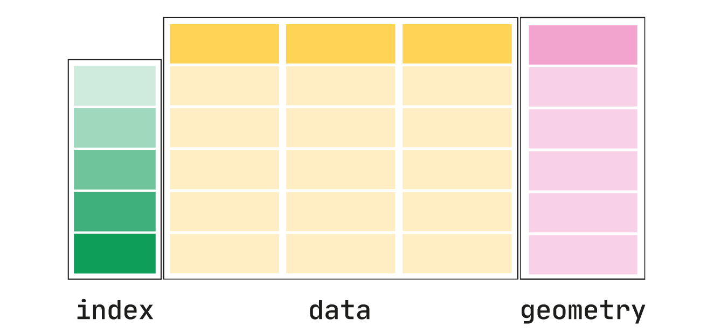

This structure allows the easy(er) merging of geographic data with other data about the geography
using pandas merges, as we will see. For this class we will use the _geopandas_ structures operationally,
and not go too deeply into how to manipulate this data.

---

## Plotting with geopandas

Geopandas DataFrame objects have a `plot` method built in, so we can create basic maps and 
choropleths in short order. These use the **matplotlib** package.

First lets get some data.


```python

import geopandas
import matplotlib.pyplot as plt

path_to_data = geopandas.datasets.get_path('nybb') # NYC boroughs
gdf = geopandas.read_file(path_to_data)

gdf
```

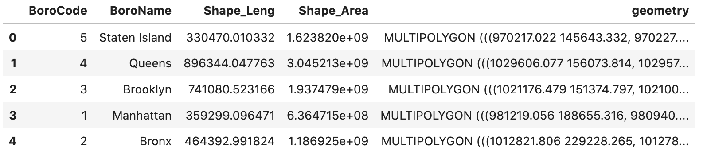


Note the structure of the last column `gdf['geometry']`. It is a _MULTIPOLYGON_ structure, which
is a way to specify the geometry of each boroughs as a set of disjoint polygons. 

We will compute the area of each borough using geopandas, for the plotting


```python
gdf = gdf.set_index('BoroName')
gdf['area'] = gdf.area
```

---

## Plotting with geopandas


```python
gdf.plot('area');
```


    
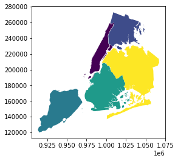
    


---

## Plotting with geopandas: layers


```python
gdf['centroid'] = gdf.centroid

ax = gdf['geometry'].plot(color = 'lightblue') #<< draw the map in monochrome
gdf['centroid'].plot(ax=ax, color='red');
```


    
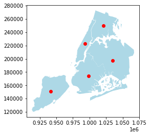
    


---

## Map projections

There are different ways of projecting the earth's surface onto a 2-D map, as we traditionally
view maps. You may have heard of Mercator projections, and others.

We can specify different map projections for the same geometry; geopandas takes care of the 
transformations from the provided geometry

---

## Map projections

```python
gdf = gdf.set_geometry('geometry')
boroughs_4326 = gdf.to_crs('EPSG:4326')
ax = boroughs_4326.plot()
ax.set_xlabel('Longitude') #<< Using matplotlib functions
ax.set_ylabel('Latitude');
```


    
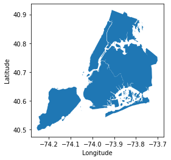
    


.footnote[Note that the axes text changed to the traditional longitude and latitude]


---

## Map projections

We can see the projection specification as well


```python
boroughs_4326.crs
```


    <Geographic 2D CRS: EPSG:4326>
    Name: WGS 84
    Axis Info [ellipsoidal]:
    - Lat[north]: Geodetic latitude (degree)
    - Lon[east]: Geodetic longitude (degree)
    Area of Use:
    - name: World.
    - bounds: (-180.0, -90.0, 180.0, 90.0)
    Datum: World Geodetic System 1984
    - Ellipsoid: WGS 84
    - Prime Meridian: Greenwich


---

## Larger geographies


```python
world = geopandas.read_file(geopandas.datasets.get_path('naturalearth_lowres'))
cities = geopandas.read_file(geopandas.datasets.get_path('naturalearth_cities'))

world.head()
```


<div>
<style scoped>
    .dataframe tbody tr th:only-of-type {
        vertical-align: middle;
    }

    .dataframe tbody tr th {
        vertical-align: top;
    }

    .dataframe thead th {
        text-align: right;
    }
</style>
<table border="1" class="dataframe">
  <thead>
    <tr style="text-align: right;">
      <th></th>
      <th>pop_est</th>
      <th>continent</th>
      <th>name</th>
      <th>iso_a3</th>
      <th>gdp_md_est</th>
      <th>geometry</th>
    </tr>
  </thead>
  <tbody>
    <tr>
      <th>0</th>
      <td>920938</td>
      <td>Oceania</td>
      <td>Fiji</td>
      <td>FJI</td>
      <td>8374.0</td>
      <td>MULTIPOLYGON (((180.00000 -16.06713, 180.00000...</td>
    </tr>
    <tr>
      <th>1</th>
      <td>53950935</td>
      <td>Africa</td>
      <td>Tanzania</td>
      <td>TZA</td>
      <td>150600.0</td>
      <td>POLYGON ((33.90371 -0.95000, 34.07262 -1.05982...</td>
    </tr>
    <tr>
      <th>2</th>
      <td>603253</td>
      <td>Africa</td>
      <td>W. Sahara</td>
      <td>ESH</td>
      <td>906.5</td>
      <td>POLYGON ((-8.66559 27.65643, -8.66512 27.58948...</td>
    </tr>
    <tr>
      <th>3</th>
      <td>35623680</td>
      <td>North America</td>
      <td>Canada</td>
      <td>CAN</td>
      <td>1674000.0</td>
      <td>MULTIPOLYGON (((-122.84000 49.00000, -122.9742...</td>
    </tr>
    <tr>
      <th>4</th>
      <td>326625791</td>
      <td>North America</td>
      <td>United States of America</td>
      <td>USA</td>
      <td>18560000.0</td>
      <td>MULTIPOLYGON (((-122.84000 49.00000, -120.0000...</td>
    </tr>
  </tbody>
</table>
</div>


---

## Larger geographies

```python
world.plot()
```


    
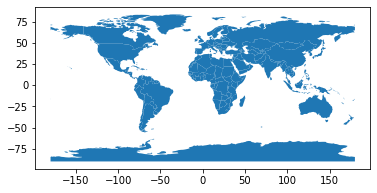
    

---

```python

fig, ax = plt.subplots()
world.plot(column='pop_est',
           ax=ax,
           legend=True,
           legend_kwds={'label': "Population by Country",
                        'orientation': "horizontal"});
```


    
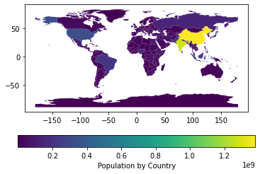
    


---

## Layering maps

We will layer ciites on top of the world map. First make sure that the geometry data are using 
the same CRS (projection)


```python
cities = cities.to_crs(world.crs) #<<

base = world.plot(color = 'white', edgecolor = 'black')
cities.plot(ax = base, marker = 'o', color = 'red', markersize = 5)
```


    
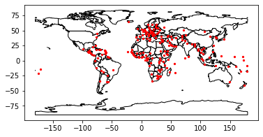
    


---

## Layering maps

You can also use matplotlib methods to layer maps as well


```python
fig,ax = plt.subplots(1,1)
ax.set_aspect('equal') # makes sure things are on the same aspect
world.plot(ax=ax, color = 'white', edgecolor = 'black')
cities.plot(ax = ax, marker = 'o', color = 'red', markersize = 5)
plt.show()
```


    

    


---

## Layering maps

Note that the order in which you put layers will affect the final map, just like in matplotlib or plotly


```python
ax = cities.plot(color = 'black')
world.plot(ax= ax);
```


    
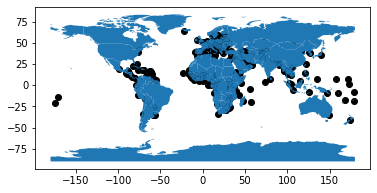
    


---

## Layering maps

We can specify the order even if our code is out of order, with the `zorder` argument


```python
ax = cities.plot(color = 'black', zorder=2)
world.plot(ax= ax);
```


    
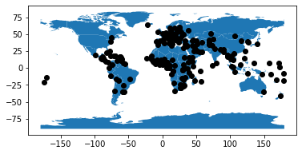
    


---

## Creating geographic aggregates

If we have regular data, we can aggregate in pandas using `groupby`. 

Sometimes we need to aggregate the geographies. For example, we might have country data and want
to show just the continents

The key to this is the `dissolve` function

---

## Creating geographic aggregates


```python
world1 = world[['continent','geometry']]
continents = world.dissolve(by = 'continent')
continents.plot(edgecolor = 'white');
```


    
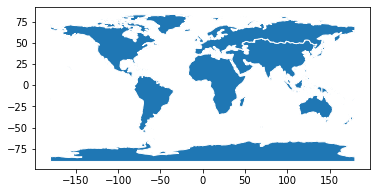
    


---

## Creating geographic aggregates

If we also want to aggregate data to the same scale, we can add arguments to the `dissolve` function


```python
world2 = world[['continent','pop_est', 'geometry']]
continent = world2.dissolve(by = 'continent', aggfunc = 'sum')
continent.plot(column = 'pop_est', cmap = 'YlOrRd');
```


    
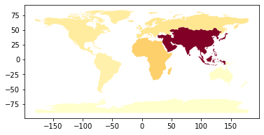
    


